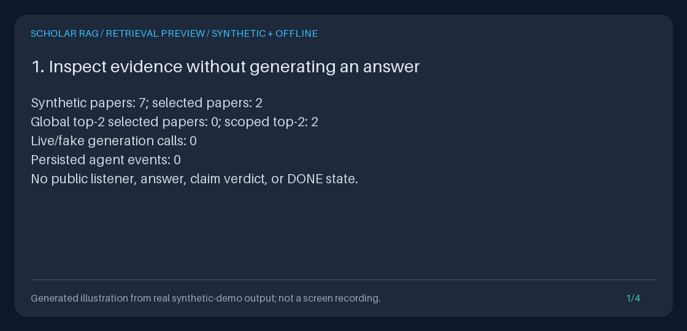

# Generation-free retrieval preview

Inspect what the agent would put in its context **before deciding whether to
generate an answer**. `POST /retrieve` and `await container.runner.preview(...)`
return the actual bounded, post-rerank passages, scores, ranks, paths, plan,
scope, and context digest. Neither entrypoint calls a live **or fake** LLM,
grounds claims, nor writes agent events.



This original four-panel GIF illustrates output from the executed synthetic demo
below. It is not a screen recording, research UI, semantic-search benchmark, or
scientific finding. The demo uses real API and Python calls and fails if generation
occurs; no public listener or persistent demo database is left behind.

## 1. The narrow feature gap

Previously, inspecting the final context required `/query` to proceed through
generation and save a completed evidence bundle. Preview separates context
inspection from that decision without introducing a second ranking algorithm.

The design is inspired by RAGFlow's documented
[`POST /api/v1/retrieval` chunk retrieval](https://github.com/infiniflow/ragflow/blob/main/docs/references/http_api_reference.md#retrieve-chunks),
which offers independent chunk access with document selection, scores, and
paging, and Haystack's
[independent document-store/retrieval abstraction](https://docs.haystack.deepset.ai/docs/document-store).
These references were reviewed on **2026-09-19**. They motivate separating
retrieval from generation, not parity with those projects. No third-party code
is copied; this endpoint does not add their paging, learned search, or platform
features, and makes no performance comparison.

## 2. What actually executes

This is the existing FastAPI/Pydantic/HTTPX/SQLite toolkit, with a **hand-written**
agent state machine, not LangGraph or Haystack integration:

1. The keyword `QueryAnalyzer` observes intent and capitalized entities.
2. `Planner` creates factual, synthesis, comparison, or hypothesis task templates
   and their operational rationale. Every task's graph hops are clamped.
3. `Executor.retrieve` merges bounded hybrid and graph results by chunk ID.
   Hybrid uses deterministic HyDE text, lexical hash-vector cosine, BM25, and RRF;
   graph traversal follows bounded entity co-mentions.
4. The shared `Executor.prepare_context` performs lexical reranking, scope checks,
   and `EvidenceSnapshot.capture`. `/query` uses this same method before its model
   call; preview projects its result into an inspection-only response.

The default dense vectors are **not learned semantic embeddings**. Rerank scores
are retrieval heuristics, not probabilities, entailment scores, or evidence
quality. A `path` preserves the winning result's existing retrieval trace, not
every candidate/alternative route or a scientific reasoning proof. Supporting
and counter-evidence tasks are merged, not adjudicated.

Configured model keys do not activate generation on `/retrieve`. Explicit Python
wiring of LLM-backed `HyDEExpander` is rejected with 409, even for a fake adapter:
silently substituting deterministic expansion would break `/query` parity.
Custom components must uphold the same no-generation contract; arbitrary injected
Python code is not sandboxed. Optional helpers and ML models are not enabled by
installing extra dependencies. For generation routing and current model IDs,
see the [provider model guide](PROVIDER_MODELS_GUIDE.md); preview needs no model
upgrade or provider credentials.

## 3. Use the HTTP API

Start an isolated loopback server using the [Quickstart](../../QUICKSTART.md).
In another terminal, ingest a synthetic note and retain its assigned ID:

```bash
export BASE_URL=http://127.0.0.1:8000
export PREVIEW_DIR="$(mktemp -d)"
curl --fail-with-body --silent --show-error "$BASE_URL/ingest/text" \
  -H 'Content-Type: application/json' \
  -d '{"title":"Synthetic note","text":"GraphRAG connects local synthetic evidence.","source":"synthetic:preview"}' \
  > "$PREVIEW_DIR/ingest.json"
DOCUMENT_ID="$(uv run python -c 'import json,sys; print(json.load(open(sys.argv[1]))["document_id"])' "$PREVIEW_DIR/ingest.json")"
curl --fail-with-body --silent --show-error "$BASE_URL/retrieve" \
  -H 'Content-Type: application/json' \
  -d "{\"query\":\"What does GraphRAG connect?\",\"document_ids\":[\"$DOCUMENT_ID\"]}" \
  > "$PREVIEW_DIR/scoped.json"
uv run python -m json.tool "$PREVIEW_DIR/scoped.json"
```

Omit `document_ids` to inspect the whole corpus:

```bash
curl --fail-with-body --silent --show-error "$BASE_URL/retrieve" \
  -H 'Content-Type: application/json' \
  -d '{"query":"Compare GraphRAG versus Retrieval."}'
```

Only `query` and optional `document_ids` are accepted; unsupported fields such as
`top_k`, `page`, or model options are 422 errors rather than ignored controls.
Query must be a nonblank string; the analyzer trims its outer whitespace.
Use the existing ingestion IDs, including imported non-ASCII IDs, not titles.
Scope accepts 1-100 supplied IDs, each a strict string of 1-128 characters after
outer trimming. Duplicates retain first-seen order and count toward the supplied
100-ID bound before deduplication. HTTP null, empty arrays, blank IDs, invalid
types, and oversized selections are rejected with 422.

Selection applies before dense/BM25 top-k and graph SQL limits, including edge
ownership: an excluded paper cannot bridge selected papers. Unknown IDs remain
in the plan but match no evidence; a wholly unknown selection returns 200 with
`sources: []`, `context: ""`, and the SHA-256 digest of the empty string. Mixed
known/unknown IDs return only eligible matches. No path retries unscoped.
BM25 corpus statistics remain global, so selection is not an isolated index.

### Response contract (version 1.0)

The response is the preview object directly, not `/query`'s `{"result": ...}`:

| Field | Meaning |
| --- | --- |
| `schema_version` | `"1.0"` for this inspection contract |
| `plan.observation` | Normalized query, intent, entities, constraints, effective `document_ids` (null means unscoped) |
| `plan.tasks`, `plan.rationale_trace` | Actual clamped tasks and operational rationale, not hidden model reasoning |
| `configuration` | Copied effective source/hop caps and retrieval/reasoning timeouts |
| `sources` | Final ordered full chunks: IDs, text, title, source, metadata, score, one-based rank, retriever, path, `text_sha256` |
| `context`, `context_format` | Exact context text and `"chunk-id-title-text-v1"` format |
| `context_sha256` | SHA-256 of the exact UTF-8 context |
| `capture_limits` | Shared source/context/serialized-snapshot bounds |

Context joins `[chunk_id] title: text` records with newline separators, in final
rank order. Text is the full indexed chunk after any configured reranking
transformation, not a 240-character citation snippet or necessarily the entire
original paper. Original ingestion may already have normalized whitespace.

There is **no run ID, DONE state, answer, citation/claim verdict, generation
record, or event list**. Planner correlation is internal only. Preview does not
create a `/runs` entry or an exportable completed run. Save the returned JSON
yourself if wanted; `/runs/{run_id}/export` remains for real completed queries.

## 4. Use Python without the HTTP server

Run this complete snippet from the installed repository environment:

```bash
uv run python - <<'PY'
import asyncio
from pathlib import Path
from tempfile import TemporaryDirectory

from api.dependencies import AppContainer
from retrieval.models import Document
from scripts.demo_retrieval_preview import offline_settings

async def inspect():
    with TemporaryDirectory(prefix="preview-guide-") as directory:
        # This demo helper uses Settings.model_validate on an init-only subclass.
        # It ignores ambient environment, .env, secret files, and provider keys.
        container = AppContainer(offline_settings(Path(directory) / "corpus.sqlite3"))
        container.ingestion_pipeline.ingest_documents([
            Document(
                document_id="synthetic-note",
                title="Synthetic note",
                text="GraphRAG connects local synthetic evidence.",
                source="synthetic:python-guide",
            )
        ])
        result = await container.runner.preview(
            "What does GraphRAG connect?", document_ids=["synthetic-note"]
        )
        print("Sources:", len(result.sources))
        print("Events:", len(container.event_log.list_events()))
        print("Context SHA-256:", result.context_sha256)
        print(result.model_dump_json(indent=2))

asyncio.run(inspect())
PY
```

For your existing application, call its `AppContainer.runner.preview` directly;
`AgentRunner` also supports it when wired with the built-in non-generative
retrieval components. Python accepts a list or tuple for `document_ids`, and
omission or `None` means unscoped. Invalid Python input raises `ValueError`
(including Pydantic validation errors) before retrieval. Operational failures
raise `agent.retrieval_preview.RetrievalPreviewError`, exposing `code`,
`status_code`, and a sanitized message; the chained `__cause__` retains the
underlying diagnostic exception for trusted local debugging.

## 5. Bounds, errors, and cancellation

The request freezes scope and a copy of the execution limits before its first
await. Configured `SCHOLAR_RAG_MAX_SOURCE_DOCS` defaults to 50 and counts **chunks**,
not distinct papers; API settings allow 1-50. `SCHOLAR_RAG_MAX_HOPS` defaults to 5
(API range 1-5) and clamps every planned task. The preview does not add a separate
per-request result cap or page through an unbounded result set.

`retrieval_timeout_seconds` defaults to 30 and bounds retrieval. The existing
`reasoning_timeout_seconds` (default 60) bounds **only context preparation** in
preview; no reasoning model runs. `/query` uses that same budget for context
preparation plus generation. These are cooperative `asyncio.wait_for` deadlines,
not process-level preemption of synchronous CPU/SQLite work.

Capture retains at most 50 passages, 262,144 UTF-8 context bytes, and a
1,048,576-byte serialized **internal snapshot** using the shared capture encoding.
The last number is not an HTTP response-size limit: plan/query overhead is
additional. Capture rejects oversized or inconsistent evidence, never silently
truncates it. Custom retrieval/reranking output exceeding the effective chunk
cap also fails. No successful partial preview is returned after a failed stage.

| HTTP status | `detail.code` / contract |
| --- | --- |
| 200 | Valid preview, including an honestly empty match set |
| 409 | `generative_retrieval`: LLM-backed HyDE would violate generation-free inspection |
| 422 | FastAPI validation details for invalid query/scope or unsupported fields |
| 500 | `planning_failed`, `retrieval_failed`, or `context_preparation_failed`; includes component failures, scope leaks, invalid/oversized capture, and cap violations |
| 504 | `retrieval_timeout` or `context_preparation_timeout` for a phase deadline; a custom planner raising TimeoutError reports `planning_timeout` |

Operational error responses have `detail.code` and `detail.message`. They never
include raw exception strings, provider keys, or a partial `sources` object.
The API logs the error code only. Successful and operational-error responses
carry `Cache-Control: no-store` and `X-Content-Type-Options: nosniff`.
Ordinary 422 validation follows FastAPI's default response handling and may echo
invalid submitted values; do not put secrets in requests.

External cancellation of an in-flight Python preview propagates
`asyncio.CancelledError` without event journaling or a success-shaped response.
There is no cancellation HTTP endpoint or durable preview job. `/query` retains
its existing response, event, cancellation, and legacy executor-override
behavior; its runtime failures still use an `ERROR` result rather than these
new preview HTTP semantics.

## 6. Privacy and interpretation

Preview avoids model transmission and agent-event persistence, **not all storage
or disclosure**. Container creation initializes SQLite schemas; ingestion persists
documents/chunks and graph data as before. The response contains full source
text, local source paths/URLs, metadata, and the query. Caller-saved files,
terminal output, proxies, server access logs, and backups need independent care.
No-store is a client/cache directive, not erasure or access control.

The API has no authentication or tenant isolation. `document_ids` is corpus
selection, not authorization. Keep it on loopback or behind your own trusted
controls; render returned text as untrusted content, not executable HTML or
instructions. Review source permissions before saving or sharing artifacts.

Exact context parity with `/query` is established for the same unchanged corpus,
configuration, and built-in components. A preview is not a transaction that
reserves evidence for a later query: ingestion, index reload, settings, and
custom components can change results, and concurrent corpus writes are not
frozen. A digest detects changed text; it is not a signature, a proof of
scientific support, or a promise of reproducible later model output.

## 7. Reproduce the demo and present a portfolio

After `uv sync --extra dev`, run:

```bash
PREVIEW_DEMO="$(mktemp -d)/retrieval-preview"
uv run python -m scripts.demo_retrieval_preview --output-dir "$PREVIEW_DEMO"
uv run python -m scripts.create_retrieval_preview_gif \
  --transcript "$PREVIEW_DEMO/transcript.txt" \
  --output "$PREVIEW_DEMO/retrieval-preview.gif"
uv run python -m json.tool "$PREVIEW_DEMO/scoped.json"
```

The scripts refuse to overwrite their named artifacts. The demo uses an isolated
temporary SQLite database and an init-only `Settings` subclass validated with
`model_validate`; ambient environment, `.env`, provider keys, and secret-file
settings do not select a database or provider. HTTP-transport-denial tests run
with **all four dummy model keys present** and execute the published Python
snippet. Pillow, already in the dev extra, renders only this measured transcript.
The renderer labels the GIF as an illustration, rejects unrelated/oversized
panels, and does not backfill or regenerate unrelated assets.

| Artifact | Portfolio evidence |
| --- | --- |
| `unscoped.json` | Actual global top-2 distractors |
| `scoped.json` | Two selected papers recovered before ranking, with exact chunks and digest |
| `graph.json` | Comparison tasks and winning hybrid/graph paths, excluding the bridge |
| `unknown.json` | Explicit unknown scope returning genuinely empty evidence |
| `transcript.txt` | Measured zero generation/events, 422 scope errors, Python/HTTP equality, and unchanged-corpus restart equality |
| `retrieval-preview.gif` | Original illustration rendered from that transcript |

Present the query and selected IDs, inspect one full passage and its path/score,
show the zero-call/event checks, then demonstrate 422 versus unknown-ID 200.
Explain why scope is not authorization, why graph links are not scientific
proof, and why changed-corpus results can differ. If you later choose `/query`,
that is a **separate generation and persistence decision**; its result can be
reviewed using the [evidence export guide](EVIDENCE_EXPORT_GUIDE.md).

This is a demonstrable software contract, not a retrieval-quality evaluation.
For quality measurements, build a labeled corpus and use the opt-in
[evaluation harness](EVALUATION_HARNESS_GUIDE.md). See
[Architecture](../../ARCHITECTURE.md) and [Safety](../../SAFETY.md) for the wider
system's actual limits.
