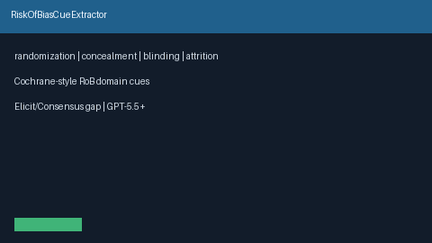

# Risk of Bias Cue Extractor Guide



`RiskOfBiasCueExtractor` scans title / abstract / methods / results text for
offline Cochrane-style risk-of-bias domain cues (`randomized`, `allocation
concealment`, `double-blind` / `blinding`, `incomplete outcome data` /
`attrition` / `loss to follow-up` / `ITT`). It returns advisory domain lists
with matched cue strings. It never calls the network.

Distinct from `StudyLimitationCueExtractor` (generic limitation categories),
`ConflictOfInterestFlagger` (COI disclosures), and `MethodExtractCard`
(PICO / study-design cards). Fills an Elicit / Consensus / SciSpace /
PaperQA Cochrane risk-of-bias surfacing gap with deterministic heuristics.
Optional later narrative can use GPT-5.5 / Claude Sonnet 4.6 / Gemini 3.x /
Kimi K2.

## Usage

```python
from retrieval.risk_of_bias_cues import RiskOfBiasCueExtractor

rows = RiskOfBiasCueExtractor().extract(
    [
        {
            "paper_id": "p1",
            "abstract": "A randomized double-blind trial with allocation concealment.",
        },
        {
            "paper_id": "clear",
            "abstract": "We study transformers without trial reporting cues.",
        },
    ]
)
for row in rows:
    print(row.paper_id, row.flagged, row.domains, row.matched_cues)
```

Domains are returned in discovery order without duplicates. Empty paper
lists return an empty tuple. Inputs are not mutated.
