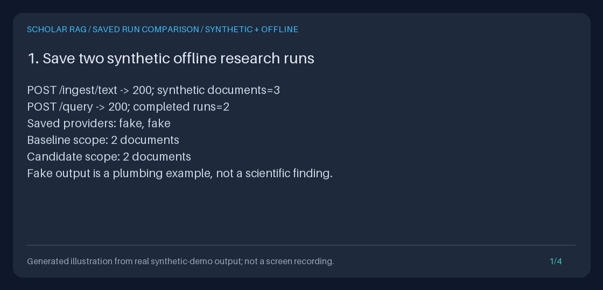

# Compare two saved research runs

`GET /runs/{baseline_run_id}/compare/{candidate_run_id}` inspects **two completed,
saved evidence bundles**. It compares the recorded query, document scope, runtime
limits, provider/model identity, answer, citation associations, and exact source
records. It does **not** retrieve again, generate another answer, rescore claims,
read the current corpus, or append run events.

The first ID is the **baseline**; the second is the **candidate**. Added evidence
belongs only to the candidate; removed evidence belongs only to the baseline.
Neither chronological order nor the newest run automatically chooses a baseline.
Comparing a run to itself is valid and reports no changes.

Each side also carries its optional saved `evidence_policy`.
`changes.evidence_policy_changed` contributes to `any_changes` even for identical
or empty contexts, with an explicit notice when policies differ. Old records
without a policy remain `None`; the four-field runtime configuration is unchanged.
See [per-paper evidence limits](PER_PAPER_EVIDENCE_LIMITS_GUIDE.md) for the request
contract and a measured policy-only comparison.



**GIF provenance:** an original generated illustration of actual offline demo
output, not a UI recording, live model inference, or a scientific-quality result.
The demonstration uses the fake adapter, real FastAPI routes, and a temporary
SQLite database. Its counts and restart assertions come from executed requests.

## Reproduce the offline demonstration

From the repository root with Python 3.11+ and [uv](https://docs.astral.sh/uv/):

```bash
uv sync --extra dev
DEMO_DIR="$(mktemp -d)"
uv run python -m scripts.demo_run_comparison --output-dir "$DEMO_DIR/artifacts"
uv run python -m json.tool "$DEMO_DIR/artifacts/comparison.json"
uv run python -m scripts.create_run_comparison_gif \
  --transcript "$DEMO_DIR/artifacts/transcript.txt" \
  --output "$DEMO_DIR/run-comparison.gif"
printf 'Review artifacts in %s\n' "$DEMO_DIR"
```

The script ingests three synthetic notes, then completes two `/query` calls.
The baseline selects the baseline-only and shared notes; the candidate selects
the shared and candidate-only notes and asks a different question. Their frozen
snapshots contain two chunks each: one shared identity, one addition, and one
removal. The demo exports both, compares them, and checks a same-run comparison.
It then deletes **only its temporary synthetic corpus**, recreates the container
against the same database, and requires byte-identical comparison output and
unchanged events. The temporary database is removed on exit.

| Saved artifact | Purpose |
| --- | --- |
| `baseline.json`, `candidate.json` | Full authoritative evidence bundles, including passages and citation associations |
| `comparison.json` | The exact response returned by the new route |
| `transcript.txt` | Measured output used by the GIF renderer |

Both scripts refuse to overwrite their named outputs. The demo requires an
explicit output directory and writes no artifacts into the repository unless
you choose that destination. The renderer uses the existing Pillow dev
dependency and shared transcript renderer, rejecting unrelated panels and
horizontal/vertical overflow. With identical input and the locked Pillow
version, repeated GIF renders are byte-identical. Run IDs and timestamps in
the JSON bundles naturally differ between new demo executions.

The shared `offline_settings(path)` helper ignores ambient environment, `.env`,
and secret-file settings, validates explicit defaults, and clears all provider
keys. Importing `api.application.create_app` does not initialize the deployment
app or its database. No default provider/model settings are changed. Historical
provider/model labels remain valid saved provenance; a saved fake output is
explicitly identified as a plumbing demonstration, not a scientific finding.
For current live options, consult the [provider model guide](PROVIDER_MODELS_GUIDE.md),
not these synthetic examples.

## Create and compare runs with curl

Start an isolated, explicitly offline API on loopback. This separate database
is retained so you can restart the server and repeat the same comparison:

```bash
# Keep DEMO_DIR from above, or set it to a fresh directory outside the repository.
uv run python - "$DEMO_DIR/http.sqlite3" <<'PY'
import sys
from pathlib import Path

import uvicorn

from api.application import create_app
from scripts.demo_evidence_export import offline_settings

uvicorn.run(
    create_app(offline_settings(Path(sys.argv[1]))),
    host="127.0.0.1",
    port=8000,
)
PY
```

In another terminal, ingest two short notes. These are invented test data, not
papers or research conclusions:

```bash
BASE_URL=http://127.0.0.1:8000
DOC_A="$(curl --fail-with-body --silent --show-error "$BASE_URL/ingest/text" \
  -H 'Content-Type: application/json' \
  -d '{"title":"Synthetic A","text":"Synthetic evidence only. GraphRAG connects research entities.","source":"synthetic:comparison:a"}' \
  | uv run python -c 'import json,sys; print(json.load(sys.stdin)["document_id"])')"
curl --fail-with-body --silent --show-error "$BASE_URL/ingest/text" \
  -H 'Content-Type: application/json' \
  -d '{"title":"Synthetic B","text":"Synthetic evidence only. GraphRAG connects research passages.","source":"synthetic:comparison:b"}'

run_id() {
  uv run python -c 'import json,sys
r = json.load(sys.stdin)["result"]
if r["state"] != "DONE":
    raise SystemExit(f"Query did not complete: {r}")
print(r["run_id"])'
}

BASELINE="$(curl --fail-with-body --silent --show-error "$BASE_URL/query" \
  -H 'Content-Type: application/json' \
  -d "{\"query\":\"What does GraphRAG connect?\",\"document_ids\":[\"$DOC_A\"]}" \
  | run_id)"
CANDIDATE="$(curl --fail-with-body --silent --show-error "$BASE_URL/query" \
  -H 'Content-Type: application/json' \
  -d '{"query":"What synthetic evidence does GraphRAG connect?"}' \
  | run_id)"
curl --fail-with-body --silent --show-error \
  "$BASE_URL/runs/$BASELINE/compare/$CANDIDATE" | uv run python -m json.tool
```

The baseline is scoped to A, while the candidate is unscoped. This is a useful
**change review**, not a fair model A/B experiment: the inputs and scope differ.
The initial `/query` calls deliberately perform retrieval and fake generation;
the subsequent comparison never does.

`/query` can return HTTP 200 with an `ERROR` state, so the helper checks the
actual result before extracting the ID. Repeating the compare request is
read-only. Swap the IDs to reverse additions/removals and rank deltas, or use
`$BASELINE` twice for a no-change control.

Stop with Ctrl-C and restart the same server command with the same database.
The same comparison is available without rerunning either query. If you lost
the IDs, use [run history](RUN_HISTORY_GUIDE.md):
`GET /runs?state=DONE&limit=20`. A recorded `DONE` is only a discovery hint;
the exporter still decides whether its saved evidence is valid.

## Python: compare the actual exported objects

The demo already creates the two runs through Python `TestClient`. You can also
compare its artifacts entirely in memory, without an application or database:

```bash
uv run python - "$DEMO_DIR/artifacts" <<'PY'
import sys
from pathlib import Path

from agent.evidence import EvidenceBundle
from agent.run_comparison import compare_bundles

directory = Path(sys.argv[1])
baseline = EvidenceBundle.model_validate_json((directory / "baseline.json").read_bytes())
candidate = EvidenceBundle.model_validate_json((directory / "candidate.json").read_bytes())
comparison = compare_bundles(baseline, candidate)
print(comparison.changes.model_dump_json(indent=2))
print(comparison.evidence.statistics.model_dump_json(indent=2))
for source in comparison.evidence.shared:
    print(source.baseline.chunk_id, source.rank_delta, source.changes.model_dump())
PY
```

`compare_bundles(baseline, candidate) -> RunComparison` is a pure operation on
validated `EvidenceBundle` objects. It does not mutate them. Pydantic validation
checks structure and snapshot consistency, not authenticity of externally
supplied files.

For existing application data, use
`container.run_comparator.compare(baseline_id, candidate_id)`. The service is
`storage.run_comparison.SavedRunComparator`, constructed from the existing
`EvidenceExporter`. It exports the baseline first, then the candidate. The same
ID is exported once. It has no corpus, model, settings, or retrieval dependency.
`RunComparisonError` retains the exporter's `code`, `status_code`, and safe
message, and adds `side` (`baseline` or `candidate`).

## Response schema and exact-change semantics

The JSON-only response is `RunComparison`, **schema version `1.0`**, discoverable
in `/docs` and `/openapi.json`. There are no new query parameters, batches,
Markdown comparison downloads, background jobs, migrations, or backfills.

| Top-level field | Contract |
| --- | --- |
| `baseline`, `candidate` | Exact run/agent identity and completion time, export URL, query summary, scope, effective configuration, saved generation identity, request/context digests, answer summary |
| `changes` | Independent boolean flags listed below; comparisons use full saved values, never just displayed prefixes |
| `any_changes` | OR of those flags; **not** byte inequality of the entire original event traces |
| `evidence` | Identity counts, added/removed summaries, all shared source comparisons, reassigned chunk IDs |
| `notices` | Inspection/quality/privacy limitations, plus differing-input and fake-provider notices when applicable |

Run IDs, agent IDs, completion timestamps, plan task/rationale details, and event
trace identity are descriptive or outside the comparison, not change criteria.
Two distinct runs with identical compared content can therefore have
`any_changes: false`. This does not assert that every field of their complete
exports is identical.

### Query, configuration, and generation

`query_changed` compares the **exact original saved query**, including whitespace
and Unicode. `document_scope_changed` compares the exact saved selection,
including order; `document_scope_membership_changed` ignores selection order but
distinguishes unscoped `null` from explicit IDs. Older evidence without scope is
unscoped, as interpreted by the exporter; no scope is guessed from its chunks.

`configuration_changed` compares the four recorded runtime values:
`max_source_docs`, `max_hops`, `retrieval_timeout_seconds`, and
`reasoning_timeout_seconds`. It cannot compare settings that were never saved
(temperature, software revision, all provider settings, or corpus revision).

`provider_changed`, `model_changed`, and `task_type_changed` compare the saved
generation identity. The model name is the configured/requested ID, not an
independently resolved provider revision. `null` means no name was recorded,
not an inferred current default. Arbitrary historical model names remain data;
comparison does not contact a provider to validate them.

`request_changed` compares the complete saved provider-independent request:
normalized prompt, context, citation ID order, and task type. `context_changed`
compares the exact context text. A whitespace-only original-query change can
leave the normalized request unchanged.

### Evidence identity, ordering, and digests

Identity is the pair **`(chunk_id, document_id)`**, never a title or text hash.
The same chunk ID reassigned to a different document is a removal and addition,
not shared evidence; its ID also appears in lexically sorted
`reassigned_chunk_ids`. No fuzzy document matching or alias reconciliation occurs.

Added summaries follow candidate rank order. Removed summaries and shared pairs
follow baseline rank order. Ranks are one-based. Each shared pair includes both
summaries, `rank_delta = candidate.rank - baseline.rank`, and exact flags for
`rank`, `text`, `title`, `source`, `metadata`, `score`, `retriever`, `path`, and the
whole source record. A positive delta means the candidate position is later,
not that its quality decreased. Additions/removals can shift shared ranks.

`source_membership_changed` compares identity sets;
`source_order_changed` compares ordered identity lists, so additions/removals
also change it. `evidence_changed` compares the entire ordered source records.
Metadata key insertion order is ignored; metadata values and list order are not.
Finite scores are compared by their canonical JSON representation (including
the distinction between positive and negative zero); no score delta is computed
that could overflow.

`identity_jaccard` is shared identity count divided by union identity count.
Both empty gives **`null`**, not `1`; one empty gives `0`. Counts and overlap are
not accuracy, relevance, support, confidence, or an evaluator result. A shared
identity can have completely different text.

Every source summary contains exact IDs, rank, final score, bounded title and
retriever previews, plus text/source/metadata/path/full-record SHA-256 digests.
There is no full source text, raw metadata dictionary, or path array duplicated
in the comparison. Follow the run's `export_url` for those details.

Text hashes use exact UTF-8. Object/list digests use JSON with sorted object
keys, compact separators, literal Unicode (`ensure_ascii=False`), and no
non-finite numbers (`allow_nan=False`). The whole source-record digest includes
rank, score, retriever, path, all chunk fields, and the text digest. A title
change changes context even when the text hash is unchanged; metadata, score,
and path changes can leave **both text and context hashes unchanged**. Their
dedicated flags and whole-record digests still detect them.

### Answer, grounding, warnings, and citations

`answer_changed` compares the whole saved answer record.
`answer_text_changed` compares the final answer text;
`claim_text_changed` compares ordered claim texts;
`grounding_changed` compares `ungrounded` and ordered per-claim `grounded` flags.
These are exact saved values, **not fresh semantic judgments**.

`citations_changed` compares the complete ordered final citations, including
document ownership, titles, and snippets. `citation_associations_changed`
compares proposed per-claim IDs, exported claim links (accepted IDs, missing IDs,
and evidence ranks), final citation links, and their document owners. A rank-only
change can change associations without changing the saved answer. A proposed-ID
change can change associations even if all final citations stay identical.

`warnings_changed` compares both ordered answer warnings and bundle warnings.
The answer summary includes counts, the saved `ungrounded` flag, exact
answer/claim/citation/association/warning digests, and a bounded text preview.
There is no claim alignment, paraphrase detection, word-level diff, citation
entailment check, or declaration that a candidate is better.

All text summaries use the same `preview`, `truncated`, `characters`,
`utf8_bytes`, and `sha256` shape. A preview is the first **240 Unicode characters**,
without normalization or an inserted ellipsis. Digests and change flags cover
the complete value, including any differing suffix after that prefix.

## Failures, bounds, privacy, and restart limits

Either side failing rejects the **whole comparison**; no partial success is
returned. If both are invalid, baseline failure wins deterministically.

| Outcome | HTTP / `detail.code` |
| --- | --- |
| No saved events for a side | `404 run_not_found` |
| No terminal `DONE` | `409 run_incomplete` |
| Failed run | `409 run_failed` |
| Legacy run without a saved snapshot | `409 snapshot_unavailable` |
| Corrupt, inconsistent, or unsupported saved evidence | `409 invalid_run_record` |

The response adds `detail.side` while preserving the authoritative exporter's
safe message and status. It never embeds the bad run ID, raw payload, provider
error, settings, or validation internals in the error message. Non-finite saved
source scores/configuration are rejected by the exporter. Database I/O failures
remain server errors, not empty successes or invented snapshots.

Each saved snapshot allows at most **50 chunks**, **262,144 UTF-8 context bytes**,
and **1,048,576 serialized snapshot bytes**. Comparison is limited to two runs,
at most 50 added, 50 removed, 50 shared pairs, and 100 union identities. Shared
pairs and additions cannot together exceed the candidate's 50 chunks. Previews
are bounded; source identifiers and saved provider/model identities are exact,
not silently clipped. Source scores are finite, and overlap has no NaN value.

These are input-snapshot/count/preview bounds, **not an absolute response-byte,
event-scan, or latency guarantee**. Exporting still reads and validates each
run's events and full saved answer. Those traces/answers and legacy identity
lengths have no new storage-size limit here. No current corpus lookup repairs
missing evidence; failures retain the exporter's original behavior.

Successful comparisons and handled export errors use `Cache-Control: no-store`
and `X-Content-Type-Options: nosniff`. Previews, identifiers, source titles,
configuration, and model identity may still be sensitive. This is not automatic
secret redaction or authentication. Treat JSON strings as untrusted text, not
HTML, terminal instructions, or executable Markdown. The existing exporter
provides separately fenced literal Markdown if you need a full human-readable
bundle; there is no new Markdown renderer for comparisons.

The service has no authentication or tenant isolation. Keep it local/trusted,
protect SQLite and artifacts, and review permissions before sharing. No raw
diagnostics or provider thinking are added to comparison payloads. Source/query
text can itself contain private material; hashes are not anonymization or
cryptographic signatures.

Saved comparisons survive ordinary corpus replacement/deletion and application
restart **only while the original event database is retained**. Corpus deletion
does not erase frozen evidence. Normal application startup still rebuilds its
in-memory retrieval indexes; the comparison operation itself does not. There
is no recovery of lost databases, reconstruction of legacy snapshots, backup,
event repair, guaranteed future model replay, or signed audit trail. The
exporter's first-terminal-event rule also applies; later event-log modifications
remain outside the append-only guarantee.

Run IDs containing `/`, or equal to `.` or `..`, cannot reliably be addressed by
the existing HTTP routes. Python callers can use exact saved IDs; such summaries
have `export_url: null`. Ordinary links percent-encode IDs rather than treating
them as URLs or filesystem paths.

## Inspiration and explicit non-goals

Concept references reviewed **2026-09-21**:

- [Langfuse](https://github.com/langfuse/langfuse),
  [experiments via the UI](https://langfuse.com/docs/evaluation/experiments/experiments-via-ui),
  and [comparing experiments](https://langfuse.com/docs/evaluation/experiments/compare-experiments)
  motivate a deliberate baseline and side-by-side inspection of saved outputs.
- [Haystack](https://github.com/deepset-ai/haystack) and its
  [evaluation documentation](https://docs.haystack.deepset.ai/docs/evaluation)
  distinguish evaluation methods and metrics from merely inspecting outputs.

This is an original local inspection workflow, not a Langfuse/Haystack
integration, experiment evaluator, model leaderboard, or feature-parity claim.
It is separate from `PreprintVersionDiffer`, which compares document versions,
and from generation-free retrieval preview, which prepares **current** evidence
rather than comparing two saved runs. The stack remains FastAPI, Pydantic,
HTTPX, SQLite, a custom state machine, and default lexical hash-vector retrieval,
not LangGraph or learned semantic embeddings.
