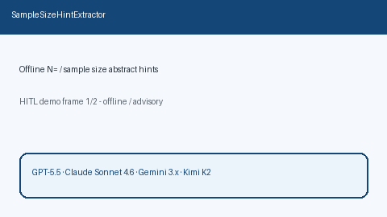

# Sample Size Hint Extractor Guide



`SampleSizeHintExtractor` scans title / abstract text for offline sample-size
cues (`N=120`, `n = 42`, `sample size of 85`, enrollment phrasing). It returns
advisory `sample_size` integers with the matched cue string. It never calls
the network.

Distinct from `MethodExtractCard` (PICO / study-design cards without sample-size
N). Fills an Elicit / Consensus / SciSpace sample-size surfacing gap with
deterministic heuristics. Optional later narrative can use GPT-5.5 /
Claude Sonnet 4.6 / Gemini 3.x / Kimi K2.

## Usage

```python
from retrieval.sample_size_hint import SampleSizeHintExtractor

hints = SampleSizeHintExtractor().extract(
    [
        {
            "paper_id": "p1",
            "abstract": "We enrolled patients (N=120) in a multicenter trial.",
        },
        {
            "paper_id": "clear",
            "abstract": "We study transformers without cohort counts.",
        },
    ]
)
for hint in hints:
    print(hint.paper_id, hint.sample_size, hint.matched_cue)
```

When multiple cues match, an explicit `N=` / `n=` form is preferred over
`sample size` phrases. Empty paper lists return an empty tuple. Inputs are not
mutated.
