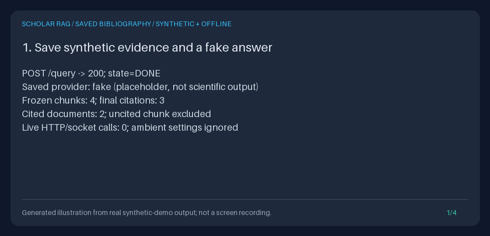

# Export cited references from a completed saved run

`GET /runs/{run_id}/bibliography?format=bibtex|json` exports a
reference-manager handoff from a completed run's **frozen evidence**.
BibTeX is the default. Only chunks in the saved final answer's `citations`
list qualify; retrieved-but-uncited sources do not become references.

There is no re-retrieval, live or fake generation, current-corpus read, DOI
lookup, metadata enrichment, or event write during export. A companion JSON
download preserves exact document IDs, cited-chunk mappings, captured
bibliographic fields, BibTeX, and warnings. Download and review that companion
before importing: a resolved citation is not proof of a scientific claim, and
captured metadata is not independently verified.



This generated illustration uses [measured offline output](../assets/saved-bibliography.txt).
It is not a screen recording, a reference-manager UI, a live-model answer, or
a quality benchmark. All documents, authors, and dates in the demonstration
are explicitly synthetic.

## Complete offline API workflow

Use Python 3.11+ and [uv](https://docs.astral.sh/uv/). From the repository root:

```bash
uv sync --extra dev
DB_DIR="$(mktemp -d)"
printf 'Keep this database path for restart: %s/corpus.sqlite3\n' "$DB_DIR"
uv run --no-sync python - "$DB_DIR/corpus.sqlite3" <<'PY'
import sys
from pathlib import Path

import uvicorn
from api.application import create_app
from scripts.demo_evidence_export import offline_settings

settings = offline_settings(Path(sys.argv[1]))
uvicorn.run(create_app(settings), host="127.0.0.1", port=8000)
PY
```

The shared `offline_settings` helper uses validated explicit settings, ignores
ambient environment/dotenv/secret-file settings, clears all four LLM provider
keys, and selects the fake adapter. Merely setting the default family to `fake`
in a normal deployment is not enough if preferred live providers have keys.
Keep this server on loopback: no authentication or tenant isolation is added.

In a second terminal, ingest only synthetic text and save a completed query:

```bash
BASE_URL=http://127.0.0.1:8000
OUTPUT_DIR="$(mktemp -d)"
curl --fail-with-body --silent --show-error "$BASE_URL/ingest/text" \
  -H 'Content-Type: application/json' \
  -d '{
    "title":"Synthetic GraphRAG workshop note",
    "text":"GraphRAG connects synthetic research evidence. This workshop note is not a publication, a real study, or a scientific finding.",
    "source":"synthetic:saved-bibliography-guide"
  }' > "$OUTPUT_DIR/ingest.json"
curl --fail-with-body --silent --show-error "$BASE_URL/query" \
  -H 'Content-Type: application/json' \
  -d '{"query":"What does GraphRAG connect?"}' > "$OUTPUT_DIR/query.json"

RUN_ID="$(uv run --no-sync python - "$OUTPUT_DIR/query.json" <<'PY'
import json
import sys
from pathlib import Path

result = json.loads(Path(sys.argv[1]).read_text(encoding="utf-8"))["result"]
if result["state"] != "DONE":
    raise SystemExit(f"Run failed: {result['error']}")
print(result["run_id"])
PY
)"
curl --fail-with-body --silent --show-error \
  "$BASE_URL/runs/$RUN_ID/bibliography?format=json" > "$OUTPUT_DIR/bibliography.json"
uv run --no-sync python -m json.tool "$OUTPUT_DIR/bibliography.json"
curl --fail-with-body --silent --show-error \
  "$BASE_URL/runs/$RUN_ID/bibliography" > "$OUTPUT_DIR/bibliography.bib"
printf 'Review both downloads in %s\n' "$OUTPUT_DIR"
```

The setup query performs normal retrieval and fake placeholder generation.
Subsequent bibliography requests do neither. `/query` can return HTTP 200
with `result.state: "ERROR"`, so the script checks the state explicitly.
To recover IDs after restart, reuse the same database and call
`GET /runs?state=DONE&limit=20`. A cataloged `DONE` is not a promise that an old
run contains a valid snapshot; legacy evidence is never backfilled.

`/ingest/text` accepts `title`, `text`, and `source`, **not arbitrary scholarly
metadata**. Its internally assigned `source_type="api"` is not a bibliographic
field. This example therefore imports a title-only `misc` reference, without
invented authors, year, DOI, or URL. For an existing metadata-bearing corpus,
use its previously completed runs; do not modify old events to add fields.

When building a new corpus in Python, populate `Document.metadata` before
ingestion and querying. For example, in an explicitly offline application:

```python
import asyncio
from pathlib import Path
from tempfile import TemporaryDirectory

from api.application import create_app
from retrieval.models import Document
from scripts.demo_evidence_export import offline_settings

document = Document(
    document_id="synthetic-paper",
    title="Synthetic reference, not a publication",
    text="GraphRAG connects synthetic research evidence. Not a scientific finding.",
    source="synthetic:python-example",
    metadata={"author": "Example Author", "year": "2024", "entry_type": "misc"},
)
with TemporaryDirectory(prefix="synthetic-bibliography-") as temporary:
    container = create_app(offline_settings(Path(temporary) / "corpus.sqlite3")).state.container
    container.ingestion_pipeline.ingest_documents([document])
    result = asyncio.run(container.runner.run("What does GraphRAG connect?"))
    if result.state != "DONE":
        raise RuntimeError(result.error)
    print(container.saved_bibliography.export(result.run_id).to_bibtex())
```

The normal ingestion pipeline copies those fields into chunks. The bibliography
later uses only the fields captured in the run's snapshot. It does not inspect
the document row, fill gaps from another chunk, or contact a scholarly connector.
This standalone snippet creates one new synthetic run and removes its temporary
database on exit; it does not add metadata to an existing saved run.

## Import into a reference manager

1. Inspect `bibliography.json`: review `warnings`, captured titles/metadata,
   exact document IDs, and each chunk's evidence rank and citation positions.
   Inspect `/runs/{run_id}/export?format=json|markdown` if you need the original
   passages and answer to assess the references.
2. In a BibTeX-capable reference manager such as Zotero, use its file-import
   workflow (for example, **File -> Import -> A file**) to select
   `bibliography.bib` as UTF-8 BibTeX. Choose a review collection rather than
   assuming the imported entries are publication-ready.
3. Check author separation, year, entry type, Unicode, and duplicate-paper
   records in the imported entries. Any manual metadata correction is a
   downstream editing decision, not a rewrite of the saved evidence.

The repository does not automate or test a desktop reference-manager import.
This is an importable metadata format, not universal importer compatibility.
Manager-specific automatic DOI/URL lookups, synchronization, or attachment
downloads are outside this export's offline guarantee; disable those separately
if needed. The JSON is a provenance companion, **not CSL-JSON**.

## Reusable Python service without a model or application

```python
from pathlib import Path

from storage.evidence_export import EvidenceExportError
from storage.saved_bibliography import SQLiteSavedBibliography

reader = SQLiteSavedBibliography(Path("/absolute/path/to/existing-corpus.sqlite3"))
try:
    bibliography = reader.export("your-completed-run-id")
except EvidenceExportError as exc:
    print(exc.status_code, exc.code, str(exc))
    raise
else:
    with Path("bibliography.json").open("x", encoding="utf-8") as output:
        output.write(bibliography.to_json())
    with Path("bibliography.bib").open("x", encoding="utf-8") as output:
        output.write(bibliography.to_bibtex())
```

An existing container exposes `container.saved_bibliography.export(run_id)`.
Construction performs no database I/O. Each export opens an escaped `file:`
URI with `mode=ro`, reads the existing event table in one transaction, then
closes the connection before formatting. Missing databases are not created.
No writable event-log initializer, settings, retriever, index, or provider is
needed by the standalone service.

Normal API startup still initializes its existing stores and rebuilds retrieval
indexes from the corpus. That is separate from the bibliography request.
Standalone use works with an event-only database even when current corpus
tables are absent. Use `to_json()` for the canonical, byte-bounded API
representation; independently reformatting JSON can change its byte size.

## Selection, identity, and JSON provenance

The authoritative `EvidenceExporter` validates completion, event ordering,
version-one evidence, context/text hashes, scope, and evidence policy. It is
fed by the shared `BoundedRunEvents` reader, also used by corpus drift.
The original `/query`, `/export`, comparisons, and reviews contracts are not
changed; there is no table, migration, backfill, or scheduled job.

Selection then follows these rules:

1. Read **only `bundle.answer.citations`** for membership. Do not parse prose
   markers, use all retrieved sources, or treat proposed/claim-only references
   as final citations. A missing chunk or mismatched citation document ID
   rejects the whole bibliography, rather than being skipped or guessed.
2. Walk matching snapshot chunks in their original frozen evidence order,
   independent of final citation order or current scores. Group by exact,
   case-sensitive `document_id`, preserving whitespace and punctuation.
   Duplicate citation records map to the same chunk with all their one-based
   `citation_numbers`; duplicate chunks of a document produce one reference.
3. Use the title and allowlisted metadata from the document's **first cited
   frozen rank**. An earlier retrieved-but-uncited chunk, even of the same
   document, supplies neither metadata nor ordering. Any raw title or
   allowlisted-metadata difference across cited chunks, including missing
   versus present fields, adds one clear warning for that document. No fields
   are merged and the first rank still wins.

Citation labels/snippets do not supply bibliographic metadata. Differences in
non-bibliographic chunk metadata are outside this comparison. Other sources'
fields and arbitrary diagnostic payloads are not returned.

| JSON field | Meaning |
| --- | --- |
| `schema_version` | `"1.0"` bibliography response contract |
| `evidence_schema_version` | `"1.0"` underlying completed-evidence contract |
| `run_id`, `context_sha256` | Exact saved run and frozen context digest |
| `sources` | At most 50 exact documents, in first-cited-frozen-rank order |
| `sources[].document_id`, `first_evidence_rank` | Exact document identity and chosen metadata rank |
| `sources[].title`, `metadata` | Raw captured title and only the accepted fields below, before formatter heuristics |
| `sources[].cited_chunks` | Frozen-order `chunk_id`, `evidence_rank`, and original final-answer `citation_numbers` |
| `bibtex` | Same string as the `.bib` download |
| `warnings` | Fixed limitations plus bounded metadata-conflict, blank-title, or empty-citation notices |

No citations produces `sources: []`, `bibtex: ""`, and an explanatory JSON
warning, even when retrieved evidence or claim references exist. The BibTeX
download is exactly zero bytes, not a placeholder reference. BibTeX-only
downloads do not contain the JSON warnings; keep the companion file.

`BibTeXExporter.export_chunks` performs the shared formatting and deterministic
key allocation. Same DOI, case-normalized key, or punctuation-normalized key
does not collapse distinct document IDs. Natural keys are reserved before
collision suffixes are allocated. Keys are unique within this ordered export,
not stable global publication IDs; a different collection/order can change a
collision suffix. Source order matches BibTeX entry order.

## Accepted metadata and formatting limitations

Keys are case-sensitive and values must be strings in the frozen chunk
metadata. These are the **only 21 accepted metadata keys**:

| Output / hint | Accepted keys, in formatter precedence order |
| --- | --- |
| DOI and preferred key seed | `doi`, `paper_doi`, `work_doi` |
| Author | `authors`, `author` |
| Explicit year | `year`, `published_year`, `publication_year` |
| Date fallback for year | `published_at`, `date`, `publication_date` |
| Venue | `journal`, `venue`, `container_title`, `booktitle` |
| Entry-type hint | `entry_type`, `bibtex_type`, `publication_type`, `type` |
| URL | `url`, `landing_url` |

The title comes from `chunk.title`, not a metadata `title` key. `chunk.source`
is not a fallback URL. Abstracts, arbitrary notes, diagnostic fields, license
tags, and other unrecognized keys are omitted, not copied into the handoff.
Accepted URLs are literal metadata: no scheme validation, dereferencing, or
automatic conversion from DOI to URL is performed.

The existing exporter picks the first nonblank value per group and trims it
for formatting; the JSON preserves the chosen chunk's raw values and keys.
Authors already containing `" and "` (case-insensitively) are kept; otherwise
commas, semicolons, and pipes are split into BibTeX `and` separators. This
heuristic can mishandle `Family, Given` names and corporate authors. An explicit
year is reduced to its first 19xx/20xx match when present, otherwise kept
verbatim; only when no explicit year is present are the date fields searched
for a 19xx/20xx year. This is not name disambiguation or date validation.

Recognized types are `article`, `inproceedings`, `incollection`, `book`,
`phdthesis`, `mastersthesis`, `techreport`, `misc`, and `unpublished`.
The existing aliases map `conference`/`proceedings` to `inproceedings`,
`preprint` to `misc`, and `journalarticle`/`journal` to `article`, after the
formatter's case/space/hyphen normalization. An unrecognized hint falls back
to `article` when a venue exists, otherwise `misc`. Venue becomes `booktitle`
only for `inproceedings`, otherwise `journal`. These are format heuristics,
not verified publication classifications.

Missing author, year, DOI, and URL remain absent. A blank captured title is
preserved in JSON; the shared formatter uses `Untitled` as a display
placeholder and this feature adds a warning. There is no invented publication
metadata or current-corpus enrichment.

**Treat the file as untrusted data, not executable LaTeX.** The formatter
escapes backslashes and braces, but it is not a complete TeX sanitizer:
percent signs, ampersands, underscores, other TeX metacharacters, arbitrary
URLs, and imported commands need downstream review. Do not compile or execute
imported BibTeX/LaTeX to inspect it. The service does not do so.

## Fixed bounds, deterministic behavior, and failures

All limits are inclusive and fixed; no new environment variable is introduced.
Excess input/output fails explicitly, never truncates, samples, silently drops
documents, or returns a partial successful bibliography.

| Boundary | Maximum |
| --- | --- |
| Frozen sources / distinct exported documents | 50, inherited from the snapshot schema |
| Final-answer citation records / mappings per document | 50; repeated citation records count too |
| Run ID and exported chunk/document IDs | 256 Unicode characters each, nonempty strict strings; not trimmed |
| Frozen context | 262,144 UTF-8 bytes |
| Frozen snapshot | 1,048,576 bytes under the existing event JSON encoding |
| Saved events | 100, including diagnostics and post-completion events |
| Individual event payload | 1,048,576 UTF-8 bytes |
| Aggregate saved event text fields | 8,388,608 UTF-8 bytes across timestamp, agent ID, run ID, event type, and payload |
| JSON and BibTeX, **each** | 262,144 UTF-8 bytes |

JSON is sorted-key, two-space-indented, `ensure_ascii=False` serialization
with a trailing newline. Its actual bytes include escaping, whitespace,
metadata, IDs, mapping lists, warnings, and the embedded BibTeX string.
BibTeX is the shared exporter's exact string, without a new prologue.
**Both representations must fit even when only one format is requested.**
A small BibTeX download can therefore fail when its provenance JSON exceeds
the limit; changing `format` is not a way to bypass that bound.

Size-only SQL preflight fetches at most 101 event rows before full payload
hydration. UTF-16 database storage gets an encoding-aware preflight, followed
by exact UTF-8 accounting. The same read transaction supplies both sizes and
payloads. SQLite lock waiting has a five-second timeout; this is not a CPU
deadline or global database-integrity audit.

Unchanged saved events produce byte-identical repeated and restarted exports,
regardless of changed/deleted corpus data or current provider settings.
The service reads the saved record, not a signed immutable archive; external
event edits or an overflow of post-completion diagnostics can change success
or failure. Review and protect the original evidence separately.

| HTTP / `detail.code` | Meaning |
| --- | --- |
| 404 / `run_not_found` | No saved events for that run |
| 409 / `run_incomplete`, `run_failed` | No successfully completed run |
| 409 / `snapshot_unavailable` | Legacy/missing capture; never reconstructed from today's corpus |
| 409 / `invalid_run_record` | Invalid/unsupported evidence, malformed metadata, or unrepresentable exported identity |
| 409 / `invalid_bibliography_citation` | A final citation's chunk is absent or its document ID disagrees with the snapshot |
| 409 / `bibliography_limit_exceeded` | More than 50 saved final citation records |
| 409 / `evidence_read_limit_exceeded` | Shared bounded event-count or byte ceiling exceeded |
| 413 / `bibliography_too_large` | Actual serialized JSON or BibTeX exceeds its UTF-8 ceiling |
| 422 / `invalid_bibliography_request` | Invalid run ID, unsupported/empty/case-mismatched format, repeated format, or unknown query parameter |
| 503 / `bibliography_storage_unavailable` | Missing/unreadable/locked database, absent event table, or other SQLite failure |

Only `format=bibtex` or `format=json` is accepted, with at most one occurrence.
There is no scope, generation, format-conversion, pagination, or bulk option.
Errors contain fixed safe `detail.code` and `detail.message` strings, not raw
SQL errors, paths, source metadata, or submitted invalid values. The API logs
service failure codes without raw contents.

Successful downloads and these errors use `Cache-Control: no-store` and
`X-Content-Type-Options: nosniff`. Success uses fixed attachment names
`bibliography.bib` / `bibliography.json`, never an interpolated run ID/title.
Content types are `application/x-bibtex; charset=utf-8` and `application/json`.
Downloaded files remain sensitive; HTTP headers neither encrypt them nor
prevent downstream copying or reference-manager synchronization.

## Reproduce and inspect the actual-output GIF

The demo uses the real document store, indexes, `/query`, and export routes.
Four synthetic chunks are captured by one fake-adapter query; the fake cites
its first three, which represent two documents. One document deliberately
has conflicting captured years. This is test data, not a scientific benchmark.

```bash
DEMO_DIR="$(mktemp -d)"
uv run --no-sync python -m scripts.demo_saved_bibliography \
  --output-dir "$DEMO_DIR/artifacts"
uv run --no-sync python -m json.tool "$DEMO_DIR/artifacts/bibliography.json"
uv run --no-sync python -m json.tool "$DEMO_DIR/artifacts/checks.json"
uv run --no-sync python -m scripts.create_saved_bibliography_gif \
  --transcript "$DEMO_DIR/artifacts/transcript.txt" \
  --output "$DEMO_DIR/saved-bibliography.gif"
printf 'Review actual artifacts in %s\n' "$DEMO_DIR"
```

The demonstration measures 4 frozen chunks, 3 final citations, 2 references,
and 1 conflict warning. Its 188-byte BibTeX download contains this actual
first entry, not a fabricated preview:

```bibtex
@misc{paper_a,
  title = {Synthetic reference A},
  author = {Ada Example},
  year = {2024}
}
```

After the setup query, guards reject agent execution, retrieval, generation,
document-store work, event writes, and HTTP/socket calls. Only the new
temporary synthetic corpus is deliberately changed/deleted, outside exports.
Reopening the application must reproduce identical bibliography bytes and
original JSON/Markdown evidence, with unchanged events and database bytes
during reads. The temporary database is removed on exit.

| Artifact | Measured content |
| --- | --- |
| `evidence.json`, `evidence.md` | Original frozen evidence including all four chunks and the fake answer |
| `bibliography.json`, `bibliography.bib` | Exact first bibliography responses, including the companion conflict warning |
| `restarted.json`, `restarted.bib` | Exact restarted responses after corpus deletion |
| `checks.json` | Byte sizes, SHA-256 digests, counts, event equality, zero export-work/network calls, and cleanup outcome |
| `transcript.txt` | Four measured panels, including actual downloaded BibTeX text |

The demo preflights named outputs and writes them using exclusive creation, so
even a file created by another writer after preflight is not overwritten.
Already-written artifacts can remain if a later file collides; this is not an
atomic multi-file transaction. The GIF renderer rejects existing destinations
and dangling symlinks at preflight, not atomically at save time: do not run
competing writers against the same GIF path. It also rejects unrelated panels
and horizontal/vertical overflow. Each GIF
has four distinct 1120 x 540 frames, displayed for 3.5 seconds, with a visible
"generated illustration" label. The same transcript and locked Pillow version
reproduce the same bytes. Run IDs/timestamps in newly generated JSON/evidence
differ between demo runs; the shown counts and transcript are deterministic.

Re-render the committed measured transcript without generating another answer:

```bash
uv run --no-sync python -m scripts.create_saved_bibliography_gif \
  --transcript docs/assets/saved-bibliography.txt \
  --output "$DEMO_DIR/reproduced.gif"
cmp docs/assets/saved-bibliography.gif "$DEMO_DIR/reproduced.gif"
```

## Privacy, related work, and current model stack

This handoff excludes original queries, answer prose, passages, provider
diagnostics, and non-bibliographic metadata. It still contains exact IDs,
titles, captured scholarly fields, and a context digest. None are guaranteed
public or anonymized; protect database backups and both downloads. Deleting
the current corpus does not erase frozen source content from saved evidence.
See [Safety](../../SAFETY.md) and [evidence exports](EVIDENCE_EXPORT_GUIDE.md).

The feature is inspired by [Future-House/paper-qa](https://github.com/Future-House/paper-qa)'s
scientific citation and metadata-aware workflows, including its use of
in-text citations and pybtex. The inspiration is a usable bibliography
handoff, **not algorithmic parity or a claim to PaperQA's accuracy**. This
repository reuses its existing [local BibTeX exporter](BIBTEX_EXPORT_GUIDE.md),
not PaperQA's metadata fetching or generation pipeline.

The runtime remains custom Observe-Decide-Act with FastAPI, Pydantic, HTTPX,
SQLite, lexical hash vectors/BM25, and lexical reranking, not learned semantic
embeddings or a new agent framework. The [provider guide](PROVIDER_MODELS_GUIDE.md)
records the 2026-09-29 official model-catalog check and compatibility caveats.
Existing defaults and provider payloads are unchanged; in particular, selecting
Sonnet 5.5 is not a validated migration of the retained Sonnet 5 thinking/output
budget contract. Bibliography export calls no model of either version.
