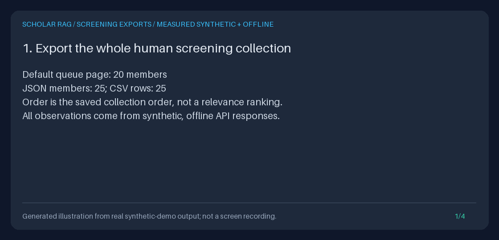

# Complete human screening exports

Download **every current member** of a paper collection as JSON or CSV, including
unscreened and stale members, human reasons, recorded timestamps, revisions,
bounded title/source labels, and consistent counts. This is a read-only,
model-free handoff from [human paper screening](PAPER_SCREENING_GUIDE.md), not
automatic screening or a new retrieval policy.



The four-frame GIF is rendered from actual synthetic API output, not a UI
recording, a live model session, or a scientific-performance benchmark. The
committed example measured 25 JSON members and 25 CSV rows, versus 20 queue items;
9,066 JSON bytes and 8,111 CSV bytes; one explicitly included ID; and zero
HTTP, generation, retrieval, or agent-event activity. New demo runs measure their
own bytes, IDs, timestamps, and hashes rather than copying those numbers.

## Why this feature

Peer workflow references checked on **2026-10-05**:

| Reference | Relevant workflow and our boundary |
| --- | --- |
| [ASReview LAB](https://github.com/ASReview/asreview) | Human relevance labels and export of labeled datasets/projects accompany active-learning screening. This inspired the missing complete-results handoff here; this feature does not implement active learning, a screening UI, an ASReview project archive, or ASReview-compatible import. |
| [PaperQA](https://github.com/Future-House/paper-qa) | Agentic literature search, full-text evidence, and cited answers motivate keeping explicit paper selection distinct from evidence gathering. This export does not run those steps or claim their scientific performance. |

Previously, this repository could save revisioned human decisions and return a
paginated queue, but had no complete, portable screening-result download.
Fetching multiple queue pages can observe different decisions between requests.
The new endpoint reads the collection, all its latest reviews, and current
catalog labels in **one SQLite transaction**. Implementation and demo are
original; no peer code, logos, or performance claims are reused.

## Reproduce the measured offline demo

From the repository root with Python 3.11+ and the development dependencies:

```bash
uv sync --extra dev
OUTPUT="$(mktemp -d)"
uv run --no-sync python scripts/demo_screening_export.py \
  --output "$OUTPUT" --gif "$OUTPUT/screening-exports.gif"
printf 'Synthetic artifacts: %s\n' "$OUTPUT"
```

The demo exercises the real in-process FastAPI endpoints with 25 synthetic notes.
It records an old include, changes the collection revision, and saves current
include/exclude/unsure decisions. It then exports all five statuses, verifies CSV
text recovery, rejects an outdated revision, and compares both downloads after
application restart. It never calls `/retrieve` or `/query`.

Artifacts are the actual `screening-results.json` and `screening-results.csv`
response bytes, `measurements.json` with byte counts and SHA-256 hashes,
`transcript.txt`, and the optional GIF. Existing named artifacts and symlinks are
not overwritten. The temporary synthetic database is removed on exit.
Environment variables, dotenv files, provider keys, and ambient database paths
are ignored by the explicit offline settings. Network, fake/live generation,
retrieval, and agent-event write methods are forbidden during the demo.

## API download

Use the [Quickstart's isolated loopback API](../../QUICKSTART.md) without model
credentials. First ingest synthetic text, create a
[collection](PAPER_COLLECTIONS_GUIDE.md), and optionally record
[human decisions](PAPER_SCREENING_GUIDE.md#api-walkthrough). Use the actual ID
and revision returned by that collection, not an assumed revision of `1`.

```bash
BASE_URL='http://127.0.0.1:8000'
COLLECTION_ID='replace-with-your-col_id'
REVISION=1
OUTPUT="$(mktemp -d)"

curl --fail --silent --show-error \
  "$BASE_URL/collections/$COLLECTION_ID/screening/export?collection_revision=$REVISION&format=json" \
  --dump-header "$OUTPUT/json-headers.txt" --output "$OUTPUT/screening-results.json"

curl --fail --silent --show-error \
  "$BASE_URL/collections/$COLLECTION_ID/screening/export?collection_revision=$REVISION&format=csv" \
  --dump-header "$OUTPUT/csv-headers.txt" --output "$OUTPUT/screening-results.csv"
```

Only consume a file after the transfer exits successfully and the file parses;
an interrupted network transfer is not a complete artifact. `format` defaults
to `json` and accepts only lowercase `json` or `csv`. `collection_revision` is
mandatory: an ASCII unsigned decimal integer of at most 19 digits, between 1
and 9,223,372,036,854,775,807. Decimal points, signs, whitespace and non-ASCII
digits are rejected. Duplicate parameters and unknown parameters, including
`limit`, `cursor`, and `status`, are errors: there is no filtered/partial export.

Success uses `application/json` or `text/csv; charset=utf-8`,
`Content-Disposition: attachment`, `Cache-Control: no-store`, and
`X-Content-Type-Options: nosniff`. The filename contains an ASCII-sanitized,
at-most-40-character collection-name slug, the full collection ID and revision,
for example `screening-Human-review-col_<32-hex-digits>-r2.csv`. A name with no
ASCII letters/digits uses `collection` as the slug. Original names are retained
inside the download; filenames and headers are not identity or provenance checks.

### JSON contract

JSON is UTF-8 without a BOM, indented, and terminated by one newline. Schema
version `1.0` has these top-level fields:

| Field | Meaning |
| --- | --- |
| `schema_version` | Export format version, not a review-standard certification |
| `collection_id`, `collection_name`, `collection_revision` | Validated current collection metadata |
| `total_documents` | Full current membership count, 1-100 |
| `counts` | Disjoint counts for `include`, `exclude`, `unsure`, `stale`, `unscreened`; sum equals `total_documents` |
| `items` | All current members in saved collection order; no ranking, cursor or pagination |
| `included_document_ids` | Exact IDs with current-revision `include` decisions, in the same order; may be `[]` |

Each item contains `document_id`, `status`, `review`, `title`, `title_truncated`,
`source`, and `source_truncated`. A review is `null` for unscreened members;
otherwise it retains its own `schema_version`, collection/document IDs,
`collection_revision`, decision `revision`, `decision`, full `reason`, and
`updated_at`. The timestamp was recorded by the decision write (server UTC for
normal PUTs), not invented at export time. It is not the time a person read a paper.

JSON preserves exact IDs and full reasons without spreadsheet prefixes. It
escapes JSON control characters normally. Titles and source labels are current
bounded catalog prefixes, not full bibliographic records or paper contents.
Their truncation flags are explicit; no member or reason is silently dropped.
There are no document bodies, passages, private metadata dictionaries, model
outputs, reviewer identities, or generated conclusions in this schema.

### CSV contract and formula safety

CSV has one header and one row per member, no metadata preamble, UTF-8 without a
BOM, comma delimiters, doubled embedded quotes, and CRLF record separators.
Every field is quoted. Embedded Unicode, commas, quotes, CR and LF in text
remain inside their quoted cells; use a CSV reader, not line splitting.

The columns are:

```text
schema_version,csv_text_encoding,collection_id,collection_name,collection_revision,total_documents,count_unscreened,count_include,count_exclude,count_unsure,count_stale,document_id,title,title_truncated,source,source_truncated,status,included_document_id,review_schema_version,review_collection_revision,review_revision,review_decision,review_reason,review_updated_at
```

Collection metadata and global counts repeat on every row. `included_document_id`
contains an ID only when that row's **current status** is `include`; it is empty
for stale includes and every other status. Review IDs equal the row's IDs and
are not duplicated. A stale row keeps its old `review_decision`,
`review_collection_revision`, and `review_revision`. Unscreened rows have empty
review columns. Recorded timestamps use ISO 8601 with an explicit offset
(`+00:00` for UTC, equivalent to JSON's `Z`).

**Every textual data cell has exactly one added ASCII apostrophe (`'`), including
safe-looking text, IDs, statuses, timestamps and schema versions.** This avoids
guessing which leading whitespace or control characters a spreadsheet might
ignore before `=`, `+`, `-`, or `@`. Quoting alone is not formula protection.
The `csv_text_encoding` cell is therefore `'apostrophe-prefix-v1`. Numeric
revisions/counts remain decimal numbers; truncation booleans are `true`/`false`.
Headers are fixed ASCII names, not user data.

| Original textual value | Value returned by a CSV reader |
| --- | --- |
| `=1+1` | `'=1+1` |
| A tab followed by `@example` | An apostrophe, then the unchanged tab and `@example` |
| `'already quoted` | `''already quoted` |
| Empty title/source text | A single apostrophe |
| Absent review / absent included ID | Empty cell, without an apostrophe |

For exact **programmatic** recovery, remove one leading apostrophe from textual
data cells, not all leading apostrophes. Never strip whitespace. For example:

```python
import csv
from pathlib import Path

with Path("screening-results.csv").open(encoding="utf-8", newline="") as stream:
    rows = list(csv.DictReader(stream))
if any(row["csv_text_encoding"] != "'apostrophe-prefix-v1" for row in rows):
    raise ValueError("Unsupported or modified CSV text encoding.")
if any(
    row["included_document_id"] and not row["included_document_id"].startswith("'") for row in rows
):
    raise ValueError("The included-ID protection was removed; use the original download.")
included_ids = [row["included_document_id"][1:] for row in rows if row["included_document_id"]]
if not included_ids:
    raise ValueError("No current includes; do not issue an unscoped retrieval request.")
```

Import as UTF-8 and preferably keep all columns as text in a spreadsheet.
Some spreadsheet programs display the protective apostrophe; others hide it.
Re-saving through a spreadsheet may strip protection, normalize newlines or
Unicode, drop controls, or round 64-bit revision numbers. Do not remove the
prefix and reopen untrusted values as spreadsheet formulas. The reversible
contract applies to the original file through a conforming CSV reader, **not**
to arbitrary spreadsheet re-saves. Preserve JSON as the canonical machine copy.
Imported opaque IDs can contain NUL; JSON and Python CSV preserve them, but
spreadsheets may not. NUL-bearing title/source labels instead fail export with
409; existing catalog and queue behavior is unchanged.

## Standalone Python example, fully offline

This creates only a temporary synthetic corpus and saves downloads to a new
directory. It requires no API server or model keys:

```bash
OUTPUT="$(mktemp -d)"
uv run --no-sync python - "$OUTPUT" <<'PY'
import json
import sys
from pathlib import Path
from tempfile import TemporaryDirectory
from retrieval.models import Document
from storage.document_store import SQLiteDocumentStore
from storage.paper_screening import ScreeningSubmission, SQLitePaperScreening

output = Path(sys.argv[1])
with TemporaryDirectory(prefix="screening-export-example-") as temporary:
    database = Path(temporary) / "corpus.sqlite3"
    SQLiteDocumentStore(database).add_documents([
        Document(document_id="synthetic-methods", title="Synthetic methods",
                 source="synthetic", text="Not a real publication."),
        Document(document_id="synthetic-background", title="Synthetic background",
                 source="synthetic", text="Not a real publication."),
    ], [])
    store = SQLitePaperScreening(database)
    collection = store.collections.create(
        name="Synthetic review",
        document_ids=["synthetic-methods", "synthetic-background"],
    )
    store.submit(collection.collection_id, "synthetic-methods", ScreeningSubmission(
        collection_revision=collection.revision, expected_decision_revision=0,
        decision="include", reason="Synthetic human judgment for this example.",
    ))
    for format in ("json", "csv"):
        download = store.export_results(
            collection.collection_id,
            collection_revision=collection.revision,
            format=format,
        )
        with (output / download.filename).open("xb") as destination:
            destination.write(download.content)
    selection = json.loads(store.export_results(
        collection.collection_id, collection_revision=collection.revision,
    ).content)["included_document_ids"]
    if not selection:
        raise ValueError("No current included papers; do not remove the scope.")
    print({"document_ids": selection})
PY
```

For an existing database, use its explicit path and actual saved collection
ID/revision instead of the synthetic setup. Construction reuses the existing
collection and decision stores; export adds no table or schema. The direct
service returns immutable `ScreeningDownload.content` bytes, `media_type`, and
`filename`, already checked against the same byte cap as the API. Invalid Python
inputs raise Pydantic `ValidationError`; booleans, floats and numeric strings are
not accepted as revisions. Storage/content failures raise `CollectionError`
with the documented code and HTTP-equivalent status.

### Explicit retrieval handoff

Only pass a **nonempty** `included_document_ids` list (or decoded CSV included IDs)
as `document_ids` to a later `/retrieve` or `/query` request. For example:

```json
{"query":"Which methods are described?","document_ids":["synthetic-methods"]}
```

The example request needs those IDs in that later server's corpus; the standalone
example deliberately removes its temporary corpus. Exports are not corpus
imports, and IDs are not automatically transferable to an unrelated database.
Never substitute the original `collection_id`, which still selects excluded,
unsure, stale and unscreened members. Never replace an empty list with `null` or
omit `document_ids`: both change the scope. Existing retrieval rejects `[]` with
422. Exports themselves never start retrieval.

## Consistency, limits, and failures

Any collection revision change, even a rename, makes older opinions stale.
Removed members are absent; re-added members retain stale opinions until
explicitly re-screened. There is no collection-wide review revision: each
review has its own revision. Passing `collection_revision` pins membership, not
the latest opinions or document labels across separate calls. JSON and CSV
requests can legitimately differ if a writer changes data between them.
Within each request, even a concurrent WAL writer cannot mix old membership or
reviews with new labels.

No export-time timestamp, audit event, indexing, HTTP, retrieval, or generation
is produced. An unchanged database yields identical bytes after restart.
The snapshot is materialized inside one read transaction; serialization happens
from those copied values, not additional database reads.

| Bound | Behavior |
| --- | --- |
| Members | All 1-100 current members; exact IDs retain the existing 128-character selection bound |
| Revisions | 1 through the signed 64-bit maximum; review revisions and timestamps are retained |
| Human reason | Existing nonblank 1-1000-character Unicode bound; never truncated by export |
| Labels | Title at most 300 characters, source at most 512; per-field truncation flags |
| Label reads | At most 1,204 title bytes and 2,052 source bytes per member, decoded with the database's UTF-8/UTF-16 encoding |
| Review reads | Existing bounded record reader and strict consistency validators; every current member checked, including the last |
| Full response body | At most **524,288 bytes**, including JSON indentation/newline or CSV prefixes/quoting/CRLF; headers are not counted |

Only the bounded label prefixes are decoded; omitted tails are not exported or
fully Unicode-validated. NUL checks cover the entire title/source. Invalid
selected records fail closed; unrelated papers and nonmember reviews are not
loaded. No paper body, chunk text, or arbitrary metadata JSON is read.

| HTTP | Stable code | Action |
| --- | --- | --- |
| 404 | `collection_not_found` | Confirm the collection still exists |
| 409 | `collection_revision_conflict` | Read the collection again and deliberately choose its new revision |
| 409 | `collection_documents_missing` | Restore missing corpus members or explicitly revise the collection |
| 409 | `invalid_collection_record`, `invalid_screening_record`, `invalid_document_record` | Inspect/repair the local source data; no automatic repair or omitted rows |
| 413 | `screening_export_too_large` | The requested full serialization cannot fit; no partial result is returned |
| 422 | `invalid_screening_request` | Correct IDs, revision, format, duplicate or unsupported query parameters |
| 503 | `collection_storage_error` | Retry when the existing SQLite storage is available |

The byte cap is applied to the requested format; one format may fit when the
other does not. There is no "smaller page" remedy for a complete export. Do not
represent manually combined queue pages as this atomic full export. Operational
and validation errors carry `no-store`/`nosniff`, never attachment headers or
successful-looking partial data. Application logs contain stable error codes,
not private reasons, labels, stored JSON, or raw SQLite diagnostics. Separately
configured HTTP access logs may still record request URLs.

## Privacy and honest portfolio use

Reasons, collection names, titles, sources and opaque IDs may identify private
work. Review them before sharing. `no-store` is not encryption, access control,
or deletion of a downloaded file. The API has no authenticated reviewers, tenant
isolation, or permission system; keep it on loopback or behind independently
managed access controls. No claim of authenticated attribution is made.

These are latest human opinions, not an append-only audit history, signed
approvals, PRISMA compliance, or evidence of scientific correctness. Collection
revisions do not track paper-content edits. Titles/sources are read at export
time, and later retrieval can see changed or missing content. A download freezes
its own bytes, **not paper contents or a future retrieval corpus**.

For a portfolio, show the actual artifacts alongside the measured GIF; explain
the 20-versus-25 completeness check, stale-include exclusion, bounded labels,
reversible CSV protection, revision conflict, and read-only restart behavior.
Label the demonstration synthetic/offline, and describe engineering invariants,
not research quality or review completeness.

The implementation uses FastAPI, Pydantic, SQLite and Python's standard CSV
writer. The surrounding agent is a custom state machine, not LangGraph.
No model settings are changed or required; optional provider configuration
remains documented in the [provider guide](PROVIDER_MODELS_GUIDE.md).
