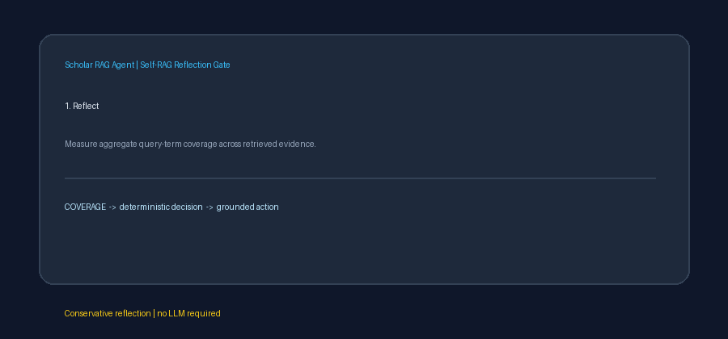

# Self-RAG Reflection Gate Guide



`SelfRagReflectionGate` performs a conservative reflection step after retrieval
and before answer generation. Inspired by Self-RAG reflection tokens and
LangGraph gating patterns, it produces an inspectable `SUPPORT`, `PARTIAL`, or
`REFUSE` decision without an LLM or network call. Accepted evidence can then be
sent to GPT-5.5, Claude Sonnet 4.6, Gemini 3.x, or Kimi K2.

## Decision policy

The gate measures aggregate coverage of distinct, non-stopword query terms
across result titles and text:

```text
coverage = covered query terms / all query terms
```

With the default thresholds:

- `SUPPORT`: coverage is at least `0.75` and no conflict is detected.
- `PARTIAL`: coverage is at least `0.25` but incomplete, or otherwise strong
  evidence contains opposing cues.
- `REFUSE`: coverage is below `0.25`, retrieval is empty or irrelevant, or the
  query has no content terms.

Both thresholds are configurable, inclusive, finite values in `[0, 1]`.
`partial_threshold` cannot exceed `support_threshold`.

## Conflict heuristics

Query-relevant result pairs are compared on four lexical axes:

1. direction, such as `improves` versus `worsens`;
2. efficacy, such as `effective` versus `ineffective`;
3. support, such as `confirms` versus `refutes`;
4. significance, including negated phrases such as `not significant`.

A pair is compared only when both chunks cover at least one shared query term.
This avoids treating unrelated positive and negative statements as a conflict.
Detected conflicts include both chunk ids and the opposing axis. These are
conservative lexical warnings, not semantic entailment judgments.

## Example

```python
from retrieval.self_rag_reflection_gate import SelfRagReflectionGate

gate = SelfRagReflectionGate(
    support_threshold=0.75,
    partial_threshold=0.25,
)
decision = gate.evaluate(
    "Does the therapy improve survival outcomes?",
    retrieved_results,
)

if decision.signal == "SUPPORT":
    synthesize(retrieved_results)
elif decision.signal == "PARTIAL":
    synthesize_with_uncertainty(decision.conflicts)
else:
    refuse_unsupported_answer(decision.reason)
```

The decision also returns sorted covered and missing terms, exact coverage, a
stable reason, and all detected conflicts. Inputs and retrieval rankings are
not modified.
