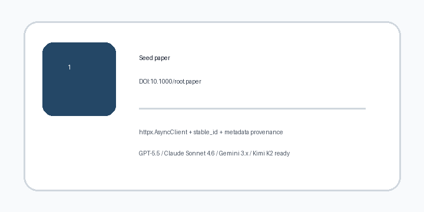

# Semantic Scholar Recommendations Guide



Use this guide when expanding a known paper into nearby literature with
**scholar-rag-agent**. The agent can route downstream synthesis through GPT-5.5 /
Claude Sonnet 4.6 / Gemini 3.x / Kimi K2 when enabled, while the Semantic
Scholar recommendations connector itself is deterministic JSON - no LLM is
required to fetch related paper metadata.

## Why recommendations

Semantic Scholar search is useful when you have a topic. Recommendations are
useful when you already trust one seed paper and want adjacent work that may use
different wording, venues, or citation neighborhoods.

The connector calls the public recommendations endpoint:

```text
GET https://api.semanticscholar.org/recommendations/v1/papers/forpaper/{seed}
    ?fields=title,abstract,year,authors,url,publicationDate,externalIds
    &limit=5
```

`seed` can be a Semantic Scholar paper id or an external id supported by the API,
such as `DOI:10.1000/example`. DOI seeds are URL-encoded before they are placed in
the path. Each request is capped at 20 recommendations to keep API usage
conservative.

## What you get

| Field | Source |
|---|---|
| `title` | `recommendedPapers[].title` |
| `text` | `recommendedPapers[].abstract`, or empty when absent |
| `source` | `url`, else Semantic Scholar `paperId` |
| `metadata.source_type` | `"semantic_scholar_recommendations"` |
| `metadata.seed_paper` | The requested seed paper id or DOI |
| `metadata.semantic_scholar_id` | `recommendedPapers[].paperId` |
| `metadata.doi` | `externalIds.DOI` |
| `metadata.authors` | Comma-separated `authors[].name` |
| `metadata.year` | `year`, falling back to `publicationDate` year |

## Example

```python
import asyncio

from ingestion.semantic_scholar import SemanticScholarConnector


async def main() -> None:
    connector = SemanticScholarConnector(api_key=None)
    documents = await connector.recommendations("DOI:10.1000/root.paper", max_results=5)
    for document in documents:
        print(document.metadata["doi"], document.title)


asyncio.run(main())
```

## Safety notes

- Blank seeds and non-positive `max_results` short-circuit with no HTTP call.
- The connector uses `httpx.AsyncClient` with a 30 second timeout and one request
  per seed.
- Returned documents use `stable_id(source, "doc")`, so repeated ingests of the
  same recommended paper converge on the same document id.
- Recommendation metadata is provenance-marked with
  `metadata.source_type="semantic_scholar_recommendations"` so it can be
  distinguished from ordinary Semantic Scholar search results.
