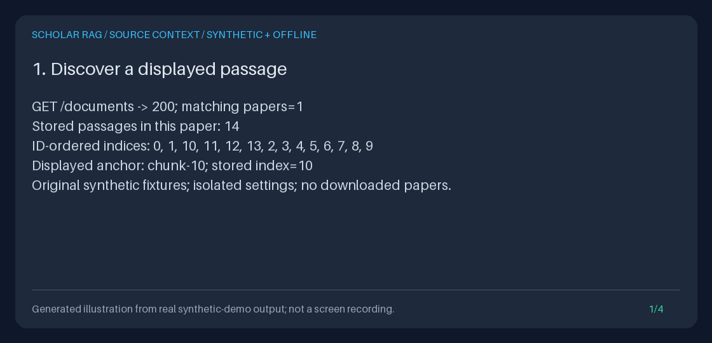

# Read the source context around an exact stored passage

Choose a displayed chunk, read the stored passages immediately before and after
it in the same paper, and keep the selected passage visibly anchored. This is
an explicit **CURRENT CORPUS** reading operation: no query, ranking, generation,
automatic evidence expansion, event write, or corpus mutation.



This reproducible GIF is a **generated illustration of measured offline
results**, not a screen recording. All passages are original synthetic
fixtures, not scientific findings. The [committed transcript](../assets/source-context.txt)
and executable demo below expose the measurements.

## Choose the right reader

| Need | Use |
| --- | --- |
| Discover stored document IDs | `GET /documents` or the [corpus explorer](CORPUS_EXPLORER_GUIDE.md) |
| Find an exact phrase and follow its matching chunk | [Native browser passage search](BROWSER_PASSAGE_SEARCH_GUIDE.md), using the existing literal API/Python reader |
| Traverse all chunks in stable ID order | Existing `GET /documents/{document_id}/chunks` or `/explore/document` |
| Read around one exact current chunk in source order | **`GET /documents/context`**, **`GET /explore/context`**, or **`SQLiteSourceContext.read`** |
| Inspect prepared query evidence without generation | [Retrieval preview](RETRIEVAL_PREVIEW_GUIDE.md), a separate operation |
| Revisit what a completed answer actually used | [Frozen evidence export/HTML reader](OFFLINE_EVIDENCE_READER_GUIDE.md), not the current corpus |

The ID-ordered chunk listing is unchanged: `chunk-10` sorts before `chunk-2`.
The new reader orders by validated numeric `metadata.chunk_index` values.
It does not infer order from IDs, titles, row insertion, retrieval rank, or
lexical similarity.

## Browser workflow

1. Start the API as described in the [Quickstart](../../QUICKSTART.md) and open
   `http://127.0.0.1:8000/explore`. Filter and select a stored paper.
2. On its passage page, choose **Read surrounding source context** beneath a
   passage. The default window requests two stored neighbors on either side.
3. Inspect the **Selected passage** and the numbered before/after passages,
   each with its exact JSON-escaped chunk ID, numeric index, source, title and
   text. Source labels remain untrusted plain text, not external links.
4. Use the native **Read window** form (0-5 per side), **Selected passage only**,
   or the two/five-per-side shortcuts. **Read around this passage** recenters
   the same-sized window on a displayed neighbor.
5. **Back to passage page** returns to the original ID-ordered page, not a guessed
   source-order page. **Back to filtered catalog** restores its filters, size and
   cursor. Recentering keeps both return paths.

When arriving from [browser passage search](BROWSER_PASSAGE_SEARCH_GUIDE.md),
**Back to search results** instead restores the original phrase, exact scope,
size and cursor, including after recentering/window changes. Search-return
state requires explicit `search_query`, `search_scope` and `search_limit`,
plus the conditional scope ID; incomplete state fails before source reading,
not with a widened return selection. Search state is navigation only, not a
second filter on the exact context read. A long passage's matched location may
be beyond this reader's 4,000-character prefix; the exact chunk still anchors.

There is no JavaScript, UI framework, external resource, browser storage, or
new dependency. Native links and forms work with keyboard navigation and narrow
screens. IDs with slashes, dot segments, quotes, `%`, `?`, `#`, `&`, `+`, or Unicode
are **query values**, not path components. Encode them with a query encoder;
never concatenate raw IDs into a URL. IDs are displayed as JSON strings:
decode that representation when copying a value into a request.

NUL/CR/LF-bearing IDs or return-state fields cannot safely round-trip through a
native form. The count form is omitted in that case; exact encoded shortcuts,
recentering and back links still work. NUL-bearing passage text or labels instead
produce an explicit HTML 409; JSON/Python preserve those text values.

## HTTP contract

```text
GET /documents/context?document_id=<exact-id>&chunk_id=<exact-id>&before=2&after=2
GET /explore/context?document_id=<exact-id>&chunk_id=<exact-id>&before=2&after=2
```

Both routes are GET-only. The JSON endpoint has a typed `SourceContext` response
documented in `/openapi.json`. The HTML route additionally accepts the existing
`limit`, `cursor`, `source`, `title`, and `catalog_cursor` solely for navigation
back to the original selection; they do not filter the context window.

| Parameter / bound | Contract |
| --- | --- |
| `document_id` | Required exact, case-sensitive Unicode ID, 1-128 characters, no surrounding whitespace |
| `chunk_id` | Required exact Unicode ID, 1-256 characters; must belong to that document |
| `before`, `after` | Integer neighbor counts, each default 2, minimum 0, maximum 5; not including the anchor |
| Window | Anchor plus up to 10 neighbors; at most 11 chunks, never borrowed from another document or the opposite side |
| Whole-document order validation | At most 2,048 chunks; SQL discovers at most 2,049 rows to detect overflow |
| Metadata parsing | At most 8,192 **stored bytes per chunk**, checked in SQL before JSON parsing, including unselected chunks in this document |
| Source index | JSON integer or canonical ASCII decimal string, from 0 through 9,223,372,036,854,775,807 |
| Returned prefixes | Text: 4,000 characters; title: 300; source: 512, with separate truncation indicators |
| HTML | Existing 1,048,576-byte complete escaped-page cap, restrictive CSP, and literal-text escaping |

There must be exactly one top-level `chunk_index` property in each chunk's JSON
object. Missing/null/boolean/fractional/negative/out-of-range indices and
noncanonical strings such as `"01"` fail. Duplicate `chunk_index` properties,
including escaped spellings of the same key, also fail. Duplicate numeric
indices or chunk identities anywhere in the selected document are ambiguous
and fail instead of being tiebroken by ID. Other metadata is not exposed.

Index gaps are allowed: `[0, 7, 19]` means three currently stored passages, not
twenty passages or reconstructed missing paragraphs. Ordinary ingestion records
zero-based source indices as strings. Stored overlapping chunk text is preserved,
not merged or deduplicated. These are **chunk windows, not sentence windows**.

For anchor index 10 in the synthetic fourteen-chunk fixture, the default returns
indices `[8, 9, 10, 11, 12]`. It includes:

- `document_id`, `anchor_chunk_id`, `anchor_chunk_index`;
- requested `before`/`after` and actual `returned_before`/`returned_after`;
- `has_more_before`/`has_more_after`: whether more stored chunks exist outside
  the returned window, even if the corresponding requested count is zero;
- `chunks` in ascending numeric source order, retaining the existing `StoredChunk`
  identity, provenance and prefix fields, plus `is_anchor` (true exactly once).

At the start/end, fewer neighbors are returned without filling from the other
side. `before=0&after=0` returns only the anchor, but still validates the entire
document's ordering. A truncated passage is not an error or an omitted chunk:
changing the window does **not** retrieve its missing tail. Consult the original
permitted source for the tail.

### Try the browser and curl without credentials

Install once with `uv sync --locked --extra dev`. Start a loopback-only fixture
server with explicit settings that ignore environment, dotenv and secret files:

```bash
uv run --no-sync python - <<'PY'
from pathlib import Path
from tempfile import TemporaryDirectory
import uvicorn
from api.application import create_app
from scripts.demo_evidence_export import offline_settings
from scripts.demo_source_context import seed_demo

with TemporaryDirectory(prefix="scholar-context-server-") as directory:
    app = create_app(offline_settings(Path(directory) / "corpus.sqlite3"))
    seed_demo(app.state.container)
    uvicorn.run(app, host="127.0.0.1", port=8766, access_log=False)
PY
```

Open `http://127.0.0.1:8766/explore`, select the synthetic methods paper and
follow a passage's context link. The temporary database disappears when the
server exits. In another terminal, read its exact special-character identity:

```bash
curl --fail-with-body --silent --show-error --get \
  'http://127.0.0.1:8766/documents/context' \
  --data-urlencode 'document_id=paper/../研?draft#v1' \
  --data-urlencode 'chunk_id=chunk-10' \
  --data-urlencode 'before=2' --data-urlencode 'after=2'
```

Use `/explore/context` with the same parameters for HTML. These GETs never invoke
the fake model either. The synthetic service is still the ordinary app: manually
calling other endpoints such as `/query` is a separate workflow with different
side effects.

## Python and restart

The standalone reader needs only an existing corpus file with the normal SQLite
document/chunk schema and JSON support. It does not load settings, initialize
tables, backfill metadata, instantiate an app, or build retrieval indexes.
`read(document_id, chunk_id, before=2, after=2)` returns a typed `SourceContext`;
Python counts are strict integers, rejecting bools, floats, strings and `None`.

This complete, tested example creates only a temporary synthetic fixture,
restarts the app, and compares actual Python/JSON/HTML reads:

<!-- offline-context-example:start -->
```python
from pathlib import Path
from tempfile import TemporaryDirectory
from fastapi.testclient import TestClient
from api.application import create_app
from scripts.demo_corpus_explorer import browsing_guards
from scripts.demo_evidence_export import offline_settings
from scripts.demo_source_context import SELECTED_ID, seed_demo
from storage.source_context import SQLiteSourceContext

with TemporaryDirectory(prefix="scholar-context-guide-") as directory:
    path = Path(directory) / "corpus.sqlite3"
    settings = offline_settings(path)
    app = create_app(settings)
    seed_demo(app.state.container)
    app = create_app(settings)
    before = path.read_bytes()
    with TestClient(app) as client, browsing_guards(app.state.container):
        result = SQLiteSourceContext(path).read(SELECTED_ID, "chunk-10")
        params = {"document_id": SELECTED_ID, "chunk_id": "chunk-10"}
        response = client.get("/documents/context", params=params)
        response.raise_for_status()
        assert response.json() == result.model_dump(mode="json")
        html = client.get("/explore/context", params=params)
        html.raise_for_status()
        assert "CURRENT CORPUS" in html.text
        print([chunk.chunk_index for chunk in result.chunks])
        print(result.anchor_chunk_id, result.returned_before, result.returned_after)
    assert path.read_bytes() == before
    assert app.state.container.event_log.list_events() == []
```
<!-- offline-context-example:end -->

For an existing authorized corpus, instantiate `SQLiteSourceContext` with its
absolute database path, or use `app.state.container.source_context.read(...)`
inside an already configured app. The standalone constructor never creates a
missing database. Changing environment variables does not change an existing
reader's file; construct a new reader or restart the app deliberately.

## Errors are not partial evidence

JSON errors contain `detail.code` and a fixed sanitized message; HTML shows a
fixed explanatory page with no partial passages. Both include no-store/nosniff,
including request-validation errors. Application logs record codes, not private
identifiers, metadata, SQL, paths, or exception details.

| Status / JSON code | Meaning |
| --- | --- |
| 404 `document_not_found` | Document absent, even if orphan chunks have its ID |
| 404 `chunk_not_found` | Exact anchor absent, stale, wrong document, or document has no chunks |
| 422 `invalid_source_context_request` | Missing/invalid IDs or counts; no clamping or fallback |
| 409 `invalid_source_order` | Missing, malformed, duplicated-key, invalid ordering metadata or invalid stored chunk identity |
| 409 `ambiguous_source_order` | Duplicate numeric indices or chunk IDs in that document |
| 409 `source_context_document_too_large` | More than 2,048 chunks; reducing the window cannot bypass whole-document validation |
| 409 `source_context_metadata_too_large` | A chunk's metadata exceeds 8,192 stored bytes; no unbounded JSON parse |
| 409 `invalid_chunk_record` | Invalid projected text/provenance or inconsistent selected evidence |
| 503 `source_context_storage_unavailable` | Missing, unreadable, locked, or unsupported SQLite storage; not an empty corpus |

Python raises Pydantic `ValidationError` for invalid arguments,
`DocumentNotFoundError` for a missing document, `DocumentChunksError` for invalid
projected evidence, or `SourceContextError` with the same `code` and `status_code`
for source-order/bound/storage failures. HTML also retains its existing explicit
409 unrepresentable-text and 413 complete-page-overflow errors.

## Current corpus, safety, and limitations

One read-only URI connection and one `BEGIN` snapshot cover document/anchor
existence, bounded ordering discovery, and selected evidence. SQL guards metadata
size before JSON operations and projects only bounded IDs/indices for discovery.
Only the selected IDs' bounded text/title/source prefixes enter Python; no full
document body or arbitrary metadata is returned. Unselected text is not fetched
or validated. UTF-8 and UTF-16 SQLite text encodings are supported.

The fixed chunk/metadata/window limits are not environment settings and do not
change `max_source_docs`, ingestion, query defaults, models, cursors or ranking.
No schema/index migration, repair, backfill or event is introduced. SQLite still
reads underlying storage pages; there is no hard latency/scan-time guarantee.
Normal app startup still initializes ordinary stores and loads all chunks into
retrieval indexes; the new reader does **not** bound or repair startup. For
isolated read-only access to an existing file, use the standalone class.

Different requests are different current snapshots. Same-ID Python ingestion
replaces the document and removes superseded chunk IDs; old anchors then return
404. Low-level incremental upserts can leave conflicting indices, which this
reader rejects rather than repairing. Text-ingestion API IDs include source,
title and text: changing those fields creates another document identity, not a
replacement of the old one. Manual same-ID text edits are visible on the next
read. Exact identity does not bind a historical version or digest. Restarts
preserve persisted content, not a frozen traversal; use saved-run exports and
[corpus drift](CORPUS_DRIFT_GUIDE.md) for historical comparisons.

HTML uses the existing escape/bidi/JSON-ID helpers and hash-authorized CSS CSP:
no scripts, external resources, unsafe-inline styles, or arbitrary return URLs.
Source labels are never automatically followed. This is not authentication or
tenant isolation. Use loopback or your own access controls, and inspect only
material you are allowed to process. GET IDs/filters may remain in browser
history, bookmarks and access logs. No-store cannot prevent screenshots, copied
text or saved artifacts. Review them before sharing.

## Reproduce the measured demo and GIF

Run against a new output directory; the scripts refuse existing named artifacts
and output symlinks. No provider credentials, server, browser installation,
external paper, or network call is required:

```bash
OUTPUT="$(mktemp -d)"
uv run --no-sync python -m scripts.demo_source_context --output-dir "$OUTPUT"
uv run --no-sync python -m scripts.create_source_context_gif \
  --transcript "$OUTPUT/transcript.txt" --output "$OUTPUT/source-context.gif"
```

The demo saves actual catalog/passage/context/anchor-only/recentered/end-window
JSON, passage and context HTML, `checks.json`, and the four-panel transcript.
Its isolated temporary SQLite database is removed. It compares Python and API
objects, follows actual HTML navigation, recreates the app, checks unchanged
database bytes/events, and counts forbidden read-call attempts with failing
guards. The GIF uses the existing Pillow renderer and labels every frame as an
illustration, not a screen recording. Saved HTML is an inspection artifact:
its native server links require a running app, not just `file://`.

Measured fixture outcomes: ID-order indices begin `0, 1, 10, 11`; the default
source window is `8, 9, 10, 11, 12`; recentering gives `9, 10, 11, 12, 13`.
The long imported passage has a 4,000-character prefix and a truncation flag.
No excluded chunk, model/retrieval/HTTP/write call, or new event is observed.
These are contract checks, **not retrieval-quality or scientific benchmarks**.

For a portfolio demonstration, show a displayed anchor, its neighboring
assumptions/limitations, the explicit edge counts and truncation warning, then
the JSON/HTML artifacts and restart checks. Explain current versus frozen
evidence and the fail-closed ordering bounds. Do not portray synthetic passages,
read counts, or source adjacency as scientific corroboration.

## Workflow inspiration, not implementation parity

Primary documentation checked **2026-10-09 America/Los_Angeles**:

- [LightRAG](https://github.com/HKUDS/LightRAG) documents source citations and
  document traceability (March 2025), returned retrieval context for evaluation
  (November 2025), and a corpus WebUI. These motivate making source inspection
  visible; this feature adds none of its graph/query/UI implementation.
- [PaperQA](https://github.com/Future-House/paper-qa) documents a local full-text
  index, contextual summarization, grounded citations and evidence gathering.
  This reader neither searches that index nor summarizes or judges evidence.
- [LlamaIndex's sentence-window example](https://developers.llamaindex.ai/python/examples/node_postprocessor/metadatareplacementdemo/)
  stores an original sentence and a surrounding-sentence window, then replaces
  the retrieved sentence with the window before generation. Our operation is
  deliberately different: a human selects an **exact stored chunk** in the
  **current corpus**, without sentence parsing, retrieval replacement, generation,
  or a benchmark-parity claim.

No upstream code, passages, benchmark results or historical model defaults were
copied. The stack remains FastAPI/Pydantic/HTTPX/SQLite with the existing custom
state machine, not LangGraph or LlamaIndex. The separately checked
[provider catalog](PROVIDER_MODELS_GUIDE.md) retains `gpt-6-astra`,
`claude-sonnet-5-5`, `gemini-3.8-flash`, and `kimi-k3`; catalog presence is not a
live compatibility or account-access test.
