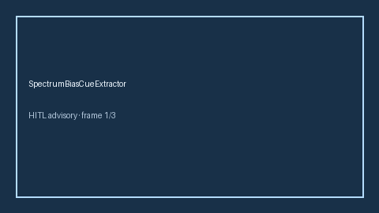

# SpectrumBiasCueExtractor Guide



Offline deterministic cue extractor. Never network I/O.
Gap vs Elicit/Consensus/AJE spectrum-bias cue extractors. Distinct from verification-bias and selection-bias cue extractors.

Optional later narrative via **GPT-5.5 / Claude Sonnet 4.6 / Gemini 3.x / Kimi K2**.

## Usage

```python
from retrieval.spectrum_bias_cues import SpectrumBiasCueExtractor

cues = SpectrumBiasCueExtractor().extract(
    [
        {
            "paper_id": "p1",
            "abstract": "Diagnostic accuracy may be inflated by spectrum bias in tertiary care.",
        }
    ]
)
assert cues[0].flagged is True
```
