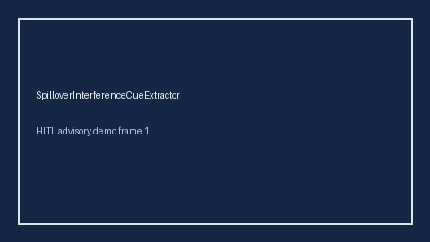

# SpilloverInterferenceCueExtractor Guide



Offline cue extractor. Never network I/O. Gap vs Elicit/Consensus/AJE spillover / interference / SUTVA cue extractors.

Optional later polish via **GPT-5.5 / Claude Sonnet 4.6 / Gemini 3.x / Kimi K2**.

Distinct from `SyntheticControlCueExtractor / IntentionToTreatCueExtractor`.

## Usage

```python
from retrieval.spillover_interference_cues import SpilloverInterferenceCueExtractor

cues = SpilloverInterferenceCueExtractor().extract(
    [
        {
            "paper_id": "p1",
            "abstract": "We observed a treatment spillover and interference between units violating SUTVA.",
        }
    ]
)
assert cues[0].flagged is True
```
