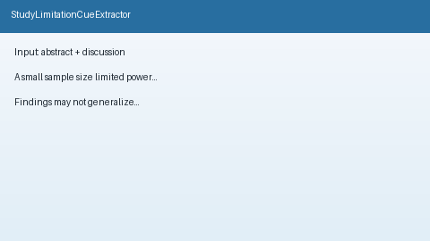

# Study Limitation Cue Extractor Guide



`StudyLimitationCueExtractor` scans abstract / discussion / limitations text
for offline study-limitation cues (small sample size / underpowered,
generalizability / single-center, confounding, selection/recall/publication
bias). It returns advisory category labels with matched cue strings. It never
calls the network.

Distinct from `SampleSizeHintExtractor` (N= integers),
`ConflictOfInterestFlagger` (COI disclosures), and `MethodExtractCard`
(PICO / study-design cards). Fills an Elicit / Consensus / SciSpace / PaperQA
limitation-cue surfacing gap with deterministic heuristics. Optional later
narrative can use GPT-5.5 / Claude Sonnet 4.6 / Gemini 3.x / Kimi K2.

## Usage

```python
from retrieval.study_limitations import StudyLimitationCueExtractor

cues = StudyLimitationCueExtractor().extract(
    [
        {
            "paper_id": "p1",
            "abstract": "A small sample size limited power in this pilot.",
            "discussion": "Findings may not generalize beyond this cohort.",
        },
        {
            "paper_id": "clear",
            "abstract": "We study transformers without limitation language.",
        },
    ]
)
for row in cues:
    print(row.paper_id, row.flagged, row.categories, row.matched_cues)
```

Empty paper lists return an empty tuple. Inputs are not mutated.
