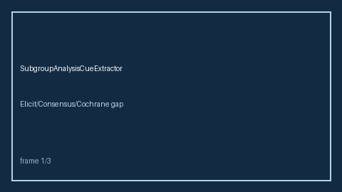

# SubgroupAnalysisCueExtractor Guide



Offline cue extractor. Never network. Optional polish via **GPT-5.5 / Claude Sonnet 4.6 / Gemini 3.x / Kimi K2**.

## Usage

```python
from retrieval.subgroup_analysis_cues import SubgroupAnalysisCueExtractor
print(SubgroupAnalysisCueExtractor().extract([{"paper_id": "p1", "abstract": "..."}]))
```
