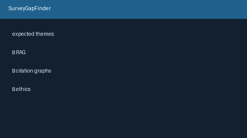

# Survey Gap Finder Guide



`SurveyGapFinder` audits a paper set against an **expected theme checklist** and
reports per-theme coverage scores plus a missing/under-covered flag.

Distinct from `RelatedWorksComposer`, which *discovers* themes by clustering
titles/abstracts — this module checks whether caller-specified themes are
actually covered. Fills an Elicit / ResearchRabbit theme-coverage gap with
offline, deterministic Jaccard scoring (no LLM call). Optional later narrative
can use GPT-5.5 / Claude Sonnet 4.6 / Gemini 3.x / Kimi K2.

## Usage

```python
from retrieval.survey_gap import SurveyGapFinder

finder = SurveyGapFinder(coverage_threshold=0.15)
gaps = finder.find(
    [
        {
            "title": "Retrieval Augmented Generation for QA",
            "abstract": "We study retrieval augmented generation.",
            "year": 2024,
        },
    ],
    expected_themes=[
        "retrieval augmented generation",
        "citation graph expansion",
    ],
)
for gap in gaps:
    print(gap.theme, gap.coverage_score, gap.missing)
```

Themes with best paper Jaccard below `coverage_threshold` are marked
`missing=True`. Empty paper lists mark every theme missing with score `0.0`.
