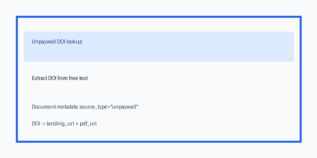

# Unpaywall Source Guide



Use this guide when wiring Unpaywall into **scholar-rag-agent**. The agent can
route downstream synthesis through GPT-5.5 / Claude Sonnet 4.6 / Gemini 3.x /
Kimi K2 when enabled, but the Unpaywall connector itself is deterministic JSON;
no LLM is required to resolve DOI open-access locations.

## Why Unpaywall

Unpaywall aggregates legal open-access copies for scholarly DOI records. Alongside
Crossref, DataCite, OpenCitations, OpenAlex, and repository connectors, it helps
the agent find an accessible landing page or PDF after a DOI has been identified
by another source or pasted directly into a query.

The API is DOI-centric and requires a contact email:

```text
GET https://api.unpaywall.org/v2/10.1038/nature12373?email=dev@example.org
```

Pass `UnpaywallConnector(email=...)` or set `UNPAYWALL_EMAIL`. Blank queries,
queries without DOI identifiers, non-positive `max_results`, and missing email
configuration return no documents and do not issue HTTP requests.

## What you get

| Field | Source |
|---|---|
| `title` | `title`, else a DOI fallback title |
| `text` | Author/journal/year descriptor plus OA status, landing page, and PDF URL |
| `source` | Best OA landing page, else best PDF, `doi_url`, or `https://doi.org/{doi}` |
| `metadata.doi` | `doi` from Unpaywall or the requested DOI |
| `metadata.year` | `year`, falling back to the leading four digits of `published_date` |
| `metadata.authors` | Comma-joined `z_authors` names |
| `metadata.journal` | `journal_name` |
| `metadata.publisher` | `publisher` |
| `metadata.genre` | `genre` |
| `metadata.is_oa` | Lowercase string form of `is_oa` |
| `metadata.oa_status` | `oa_status` |
| `metadata.landing_url` | `best_oa_location.url_for_landing_page`, else location `url` |
| `metadata.pdf_url` | `best_oa_location.url_for_pdf` |
| `metadata.host_type` | OA location `host_type` |
| `metadata.version` | OA location `version` |
| `metadata.license` | OA location `license` |
| `metadata.source_type` | `"unpaywall"` |

## Example

```python
import asyncio

from ingestion.unpaywall import UnpaywallConnector

documents = asyncio.run(
    UnpaywallConnector(email="dev@example.org").search(
        "Can I read https://doi.org/10.1038/nature12373?",
        max_results=1,
    )
)
for document in documents:
    print(document.metadata["doi"], document.metadata["landing_url"], document.metadata["pdf_url"])
```

## Safety notes

- Unpaywall requires an email contact; configure a real operational address.
- Free-text search is not supported by Unpaywall, so this connector extracts DOI
  identifiers from free text and skips non-DOI queries.
- DOI lookup failures are skipped so one missing DOI does not fail a batch.
