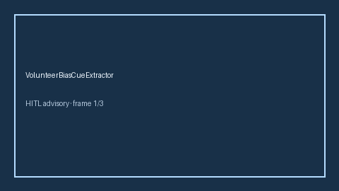

# VolunteerBiasCueExtractor Guide



Offline deterministic cue extractor. Never network I/O.
Gap vs Elicit/Consensus/AJE volunteer-bias cue extractors. Distinct from healthy-worker-effect and selection-bias cue extractors.

Optional later narrative via **GPT-5.5 / Claude Sonnet 4.6 / Gemini 3.x / Kimi K2**.

## Usage

```python
from retrieval.volunteer_bias_cues import VolunteerBiasCueExtractor

cues = VolunteerBiasCueExtractor().extract([{"paper_id": "p1", "abstract": "Enrollment may suffer from volunteer bias among health-conscious participants."}])
assert cues[0].flagged is True
```
