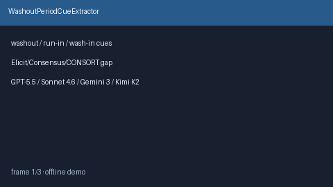

# WashoutPeriodCueExtractor Guide



Offline evidence-methods cue extractor for washout / run-in / wash-in periods.
Never network I/O. Gap vs Elicit / Consensus / CONSORT washout reporting.

Optional later polish via **GPT-5.5 / Claude Sonnet 4.6 / Gemini 3.x / Kimi K2**.

Distinct from `IntentionToTreatCueExtractor` and `ProtocolDeviationCueExtractor`.

## Usage

```python
from retrieval.washout_period_cues import WashoutPeriodCueExtractor

rows = WashoutPeriodCueExtractor().extract(
    [{"paper_id": "p1", "abstract": "After a washout period of 14 days."}]
)
assert rows[0].flagged is True
```
